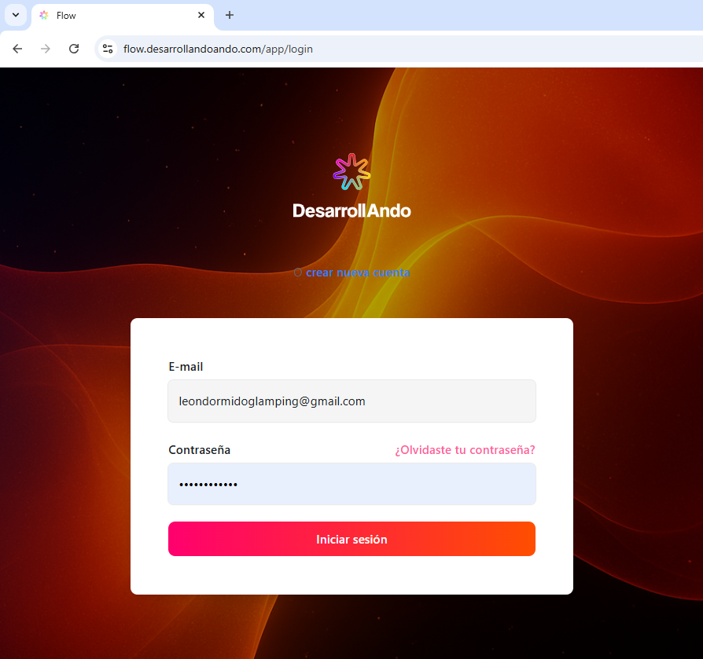
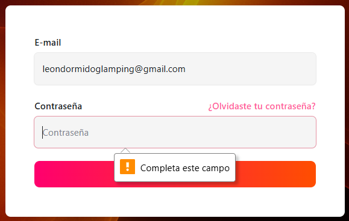
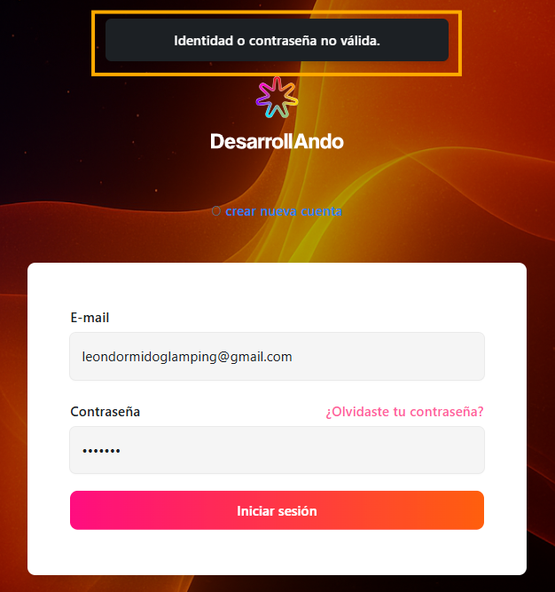

Para poder acceder a todos los beneficios de Flow, debes ingresar al siguiente link: [https://flow.desarrollandoando.com/app/login](https://flow.desarrollandoando.com/app/login) ; al hacerlo, verás la pantalla de la imagen a continuación:

En esta pantalla, hay dos campos que debes diligenciar para poder acceder a la vista principal de Flow:

1. Email: este campo verifica que los datos que ingresas tengan la estructura propia de un correo electrónico, es decir, que cuenten con el carácter @, seguido de un dominio con al menos un punto y finalizar con un TLD válido (es decir, por ejemplo com o co): [example@companyname.com](mailto:example@companyname.com)

2. Password: los parámetros de contraseña en Flow son los siguientes:

- Longitud mínima: la contraseña debe tener al menos 6 caracteres.
- Longitud máxima: la contraseña puede tener como máximo 128 caracteres.
- Caracteres especiales: debe contener al menos 1 carácter especial (por ejemplo: \!@\#$%^&\*()\_+-=\[\]{}|').
- Números: debe contener al menos 1 número (0-9).
- Letras mayúsculas: debe contener al menos 1 letra mayúscula (A-Z, latinas).
- Letras minúsculas: debe contener al menos 1 letra minúscula (a-z, latinas).

**Caso campos de login sin diligenciar:**  
Si das click en el botón “Login” sin haber diligenciado alguno de estos dos campos, verás la notificación “Completa este campo”, señalando el dato que te hace falta ingresar para que el botón de Login pueda validar tus credenciales y así redireccionarte a la página de inicio de Flow

**Caso credenciales inválidas:**  
Si en alguno de estos dos campos (Email y Password) diligencias datos que no son los registrados en la plataforma, el sistema te mostrará la notificación: “Identidad o contrasela no válida”, y permanecerás en la pantalla de login.

