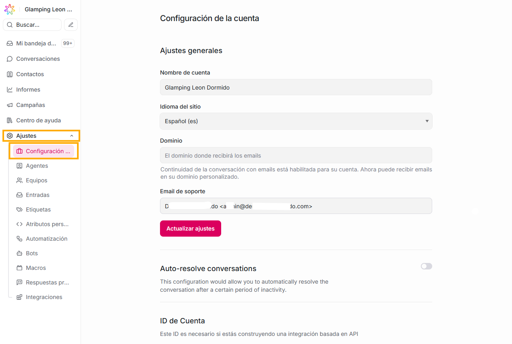
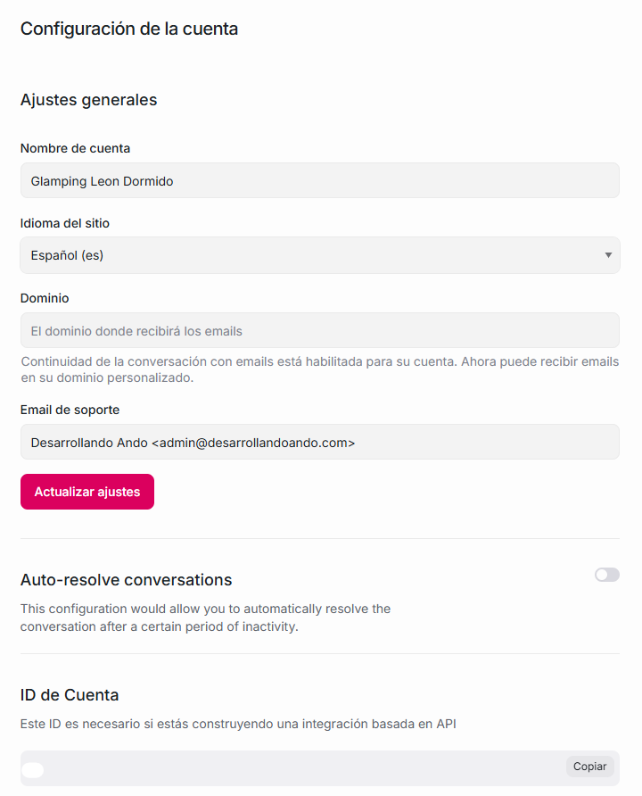

Es la configuración global de toda tu instancia de Flow. Te permite modificar información general de tu empresa.

**Qué puedes hacer aquí:**

- Cambiar el nombre de la empresa que aparece internamente.

- Ajustar el idioma de tu aplicación.

- Te suministra el ID de tu cuenta, el cual es un dato que requerirás cuando estas construyendo una integración basada en API

- Puedes activar o desactivar la opción **Auto-resolve conversations:** esta es una función que **cierra automáticamente** (marca como “Resuelta”) cualquier conversación que lleve cierto tiempo **sin actividad, que puede suceder en escenarios como:**

  - El cliente no escribe,
  - Ningún agente escribe,
  - No entran nuevos mensajes,
  - No hay cambios en el estado.
  - Si pasa la cantidad de minutos/horas/días que tú configures, Flow resuelve la conversación solo marcándola como Resuelta

