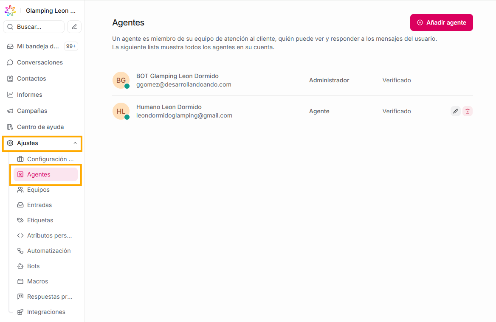
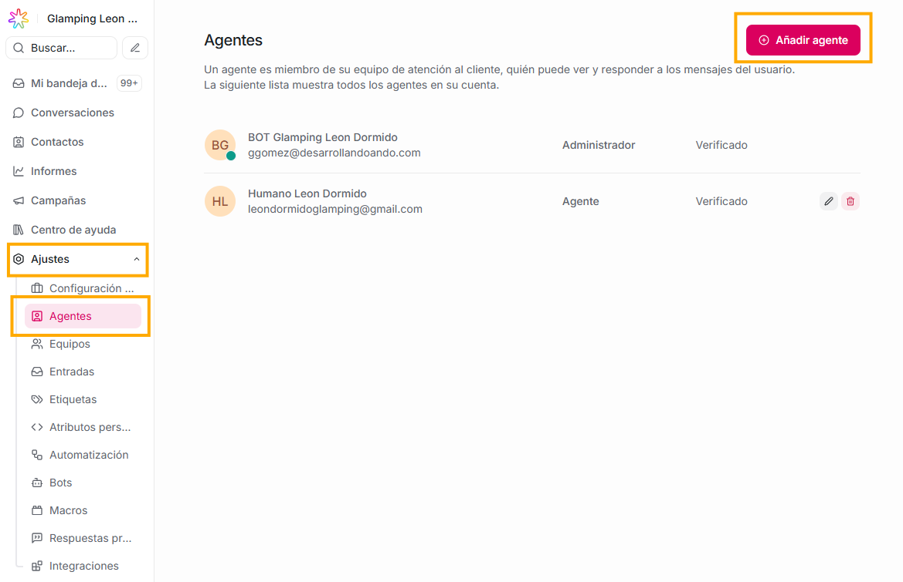
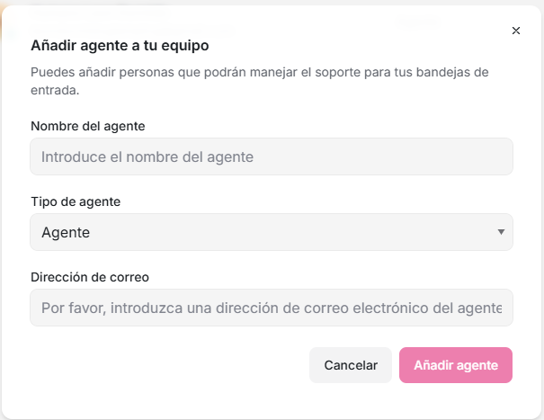
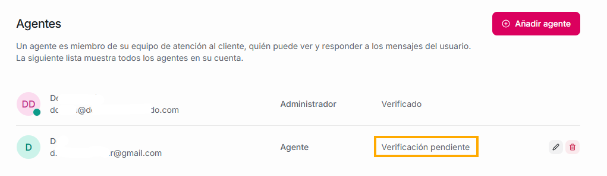
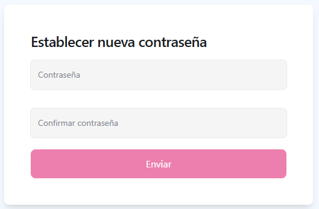
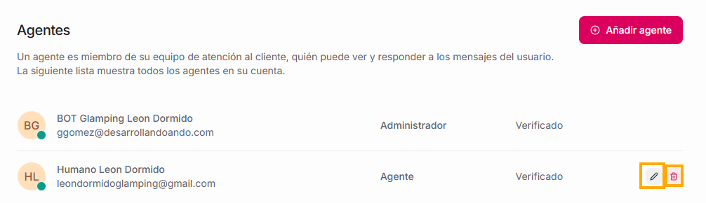
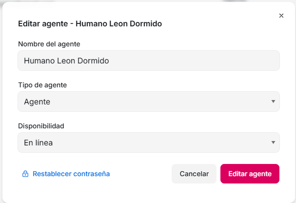
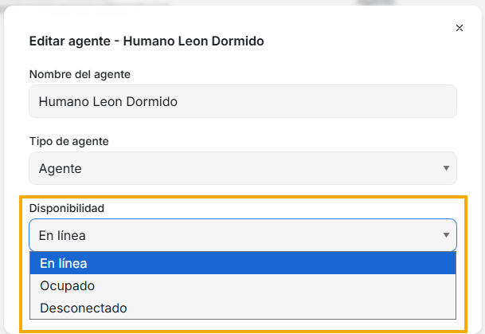

La sección **Agentes** es donde administras a las personas que trabajan dentro de la plataforma: soporte, ventas, operaciones, call center, etc.

Desde este panel puedes:

- Crear o invitar nuevos agentes.

- Asignar roles:

  - _Administrador_

  - _Agente_

- Activar/desactivar agentes.

- Gestionar permisos.

## **Cómo crear un agente**

Si quieres añadir un nuevo miembro a tu equipo de trabajo en la plataforma Agentes Virtuales ETB, solo debes:

1. Ubicarte en la sección Ajustes, - Agentes.

2. Dar click en el botón "Añadir agente"

3. Diligenciar el formulario con los siguienets datos:

- **Nombre del agente:** con el nombre que pongas aquí, aparecerá en toda la plataforma tu nuevo agente.
- **Tipo de agente:** puedes asignarle uno de dos roles: **Administrador o Agente**.
  **El rol administrador cuenta con más opciones y puede administrar varias funciones de la plataforma, el rol agente tiene visibles menos campos y solo estará a cargo de las conversaciones que le sean asignadas.**
- **Dirección de correo:** aquí debes poner el correo de la persona que ingresará al equipo.
- Dar click en el botón **Añadir agente**

Una vez lo crees, verás en tu sección de Ajustes - Agentes, que al final de los datos de tu nuevo agente dirá **"Verificación pendiente"**

En este punto, es muy importante que tu nuevo agente abra el correo con el que lo creaste y busque el email con título **"Instrucciones de confirmación"**, allí recibirá la información de que tiene una cuenta creada, y que debe dar click sobre **Confirm my account**, que aparece en color azul al final de la nota del correo. Una vez lo haga, tu agente será redireccionado a una ventana en donde deberá crear la contraseña con la que podrá ser parte de tu equipo de trabajo en Agentes Virtuales ETB.

Esta contraseña debe contar con las siguientes características:

- Al menos 6 dígitos
- Tener al menos 1 número.
- Tener al menos 1 caracter especial, por ejemplo: \*!
- Tener al menos una letra en mayúscula

Una vez lo cree, el nuevo agente será redireccionado a la plataforma Agentes Virtuales ETB, y en tu sección de - Ajustes, - Agentes, ya verás que donde antes decía "Verificación pendiente", ahora dirá **"Verificado"**

## **Editar un agente**

Si quieres editar o eliminar alguno de tus agentes, solo debes ubicarte en la sección - Ajustes, - Agentes, y verás que al finalizar cada uno de los agentes con los que cuentas, hay un ícono de lápiz.

Al dar click sobre éste, verás el siguiente formulario:

En la opción de **Disponibilidad**, podrás asignar la disponibilidad con la que siempre aparecerá tu agente:

Para guardar todos los cambios, solo debes dar clcik en **Editar agente**.

Si lo que quieres es eliminarlo, puedes dar click en el **ícono de basura** que aparece al final del nombre de tu agente.
