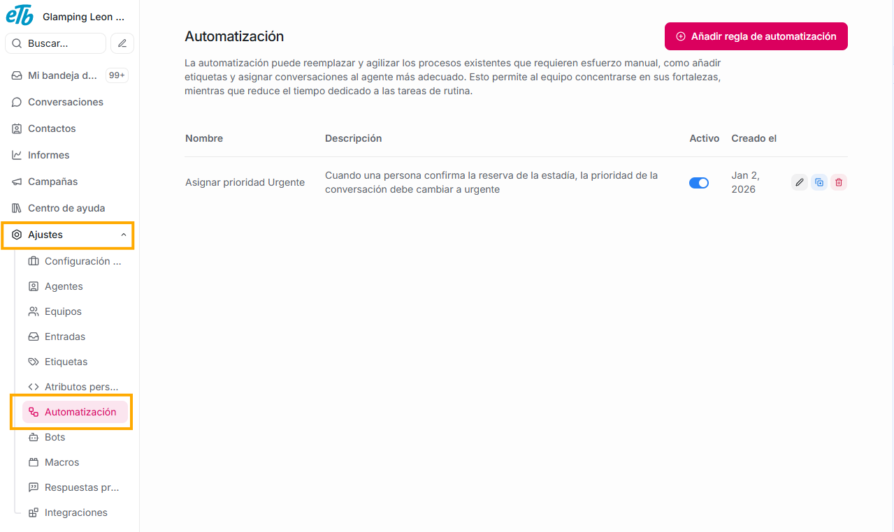
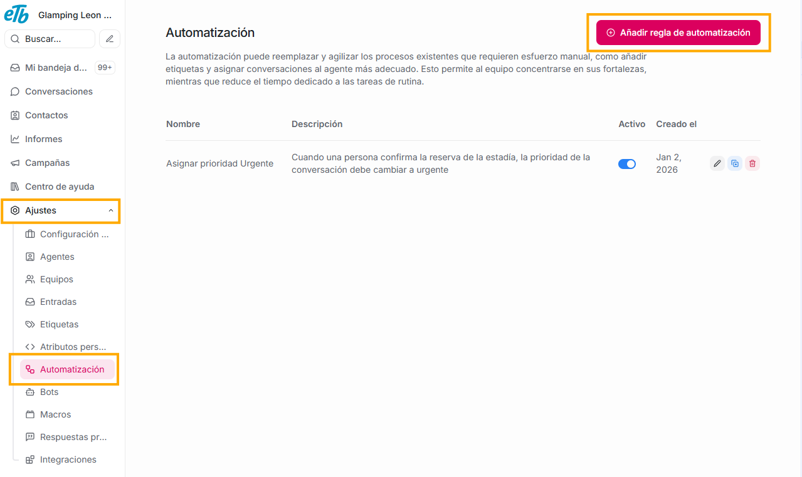
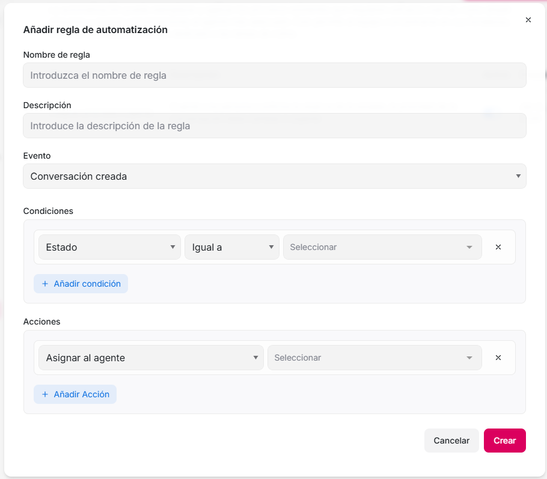
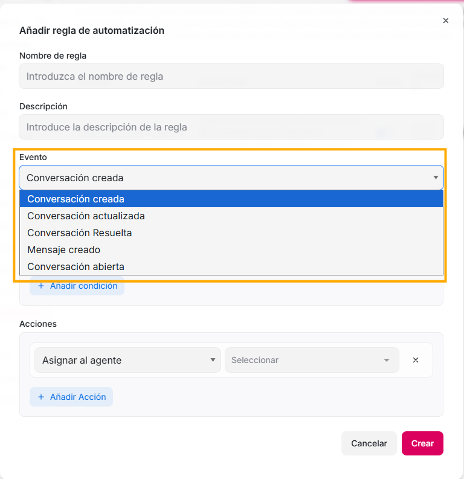
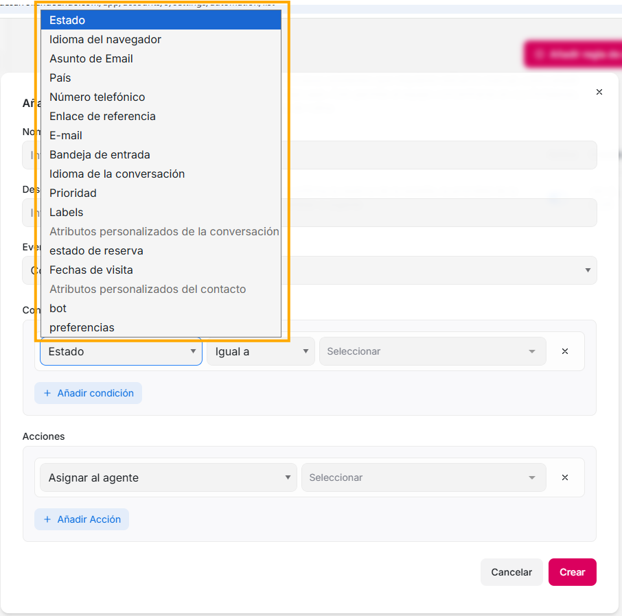
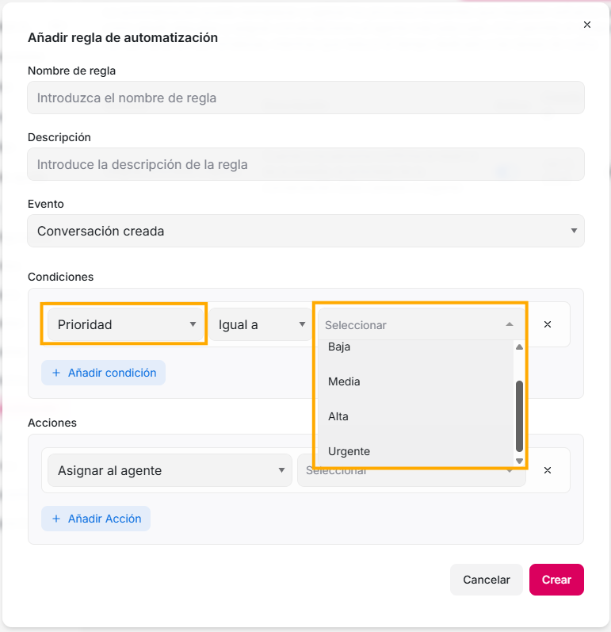
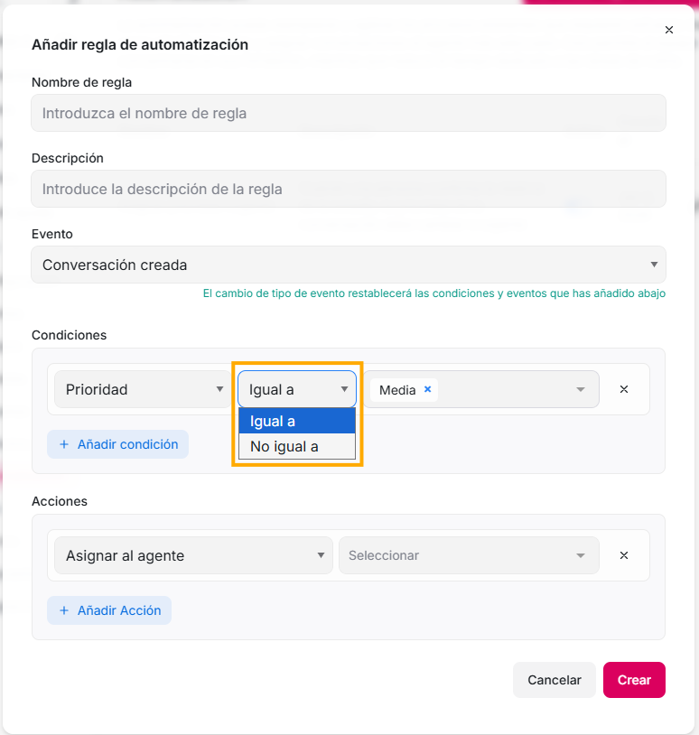
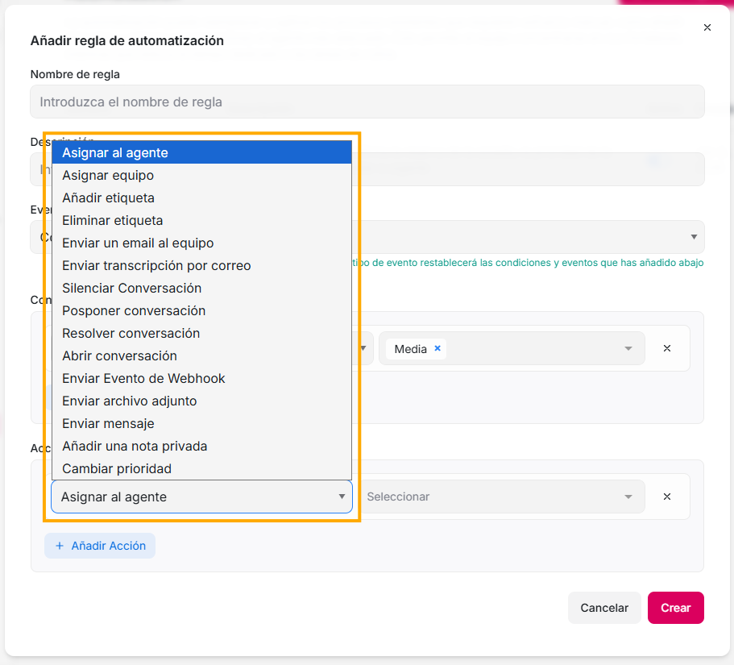
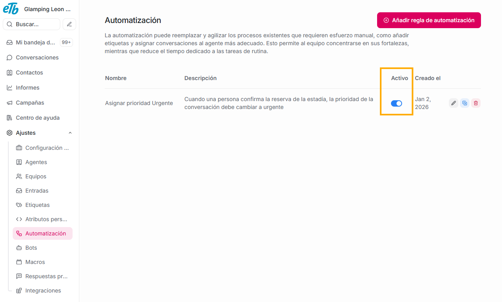

Son **reglas** creadas por ti, **que ejecutan acciones automáticamente cada vez que se cumplen ciertas condiciones**. Estas reglas y condiciones las crea e indica la persona que tenga rol administrador. De esta manera, ésta función te permite disminuir tareas para tu equipo, ya que la misma plataforma se encarga de ejecutar acciones sin que previamente tengas que hacer algo adicional a crear esta automatización.

## **¿Cómo hacer uso de las automatizaciones?**

Debes dar click en el botón **Añadir regla de automatización.**

Verás un formulario, es aquí en donde indicaremos qué condiciones se deben cumplir y qué acciones se deben ejecutar.

**Nombre de la regla:** aquí puedes asignar el título que quieres que tenga la regla que vas a crear.

**Descripción:** en este campo puedes contra detalladamente en qué consiste la regla que estas creando.

**Evento:** la plataforma te da escenarios de estado de conversaciones, puedes escoger solo uno para la regla que estas creando. Las condiciones y acciones solo se ejecutarán cuando una conversación tenga el estado que escojas en este campo.

**Condiciones:** Aquí establecerás las condiciones que quieres que se cumplan para ejecutar la regla. En el primer campo, si das click en el ícono de flecha hacia abajo que esta al final, se desglosarán varias opciones que ofrece la plataforma, y adicionalmente, verás también todos los atributos tanto de conversación como de contacto que hayas creado en tu plataforma. Dependiendo al que elijas, se darán las opciones del último campo, es decir, si elijes por ejemplo en este primer campo **prioridad**, en el último campo verás todas las opciones de prioridad que existen, o si elijes un atributo, en el último campo estarán las opciones que esten ligadas al atributo que hayas seleccionado.

**Acciones:** Luego podrás indicar que acciones la plataforma debe ejecutar cuando se cumplan las condiciones que indicaste en los campos anteriores. Si das click en el ícono de flecha hacia abajo, verás las opciones que brinda la plataforma.

Los botones de **Añadir condición** y **Añadir acción**, te permiten, si así lo quieres y te es útil, crear más de una condición o acción para tu regla.

Finalmente, cuando hayas diligenciado estos campos, al dar click en el botón **Crear** le estarás indicando a la plataforma que siempre que se cumplan las condiciones que señalaste en este formulario, automáticamente se deberán cumplir las acciones que diligenciaste.

Es muy importante que te fijes, con cada una de tus reglas, que este en azul el switch de la columna **Activo**, ya que si no es así, es señal de que has creado la regla pero no se ejecutará, o, si quieres que siga existiendo una automatización pero deseas desactivarla temporalemente, puedes dar click en este switch.

