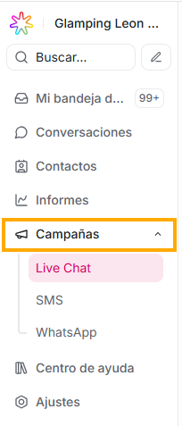
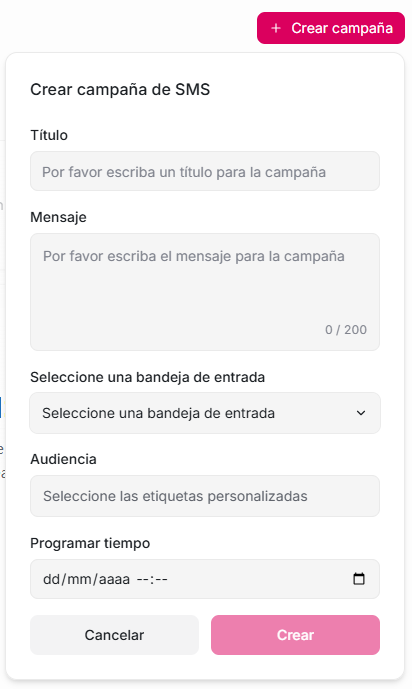

Ubicada en el panel lateral izquierdo, con esta sección Agentes Virtuales ETB te permite usar las ventajas de emplear **tres tipos de campañas**:

- **Live Chat** (campañas para el widget del sitio web)
- **SMS** (campañas enviadas por mensaje de texto)
- **WhatsApp** (campañas enviadas por Whatsapp)

### Campañas de Live Chat

Son campañas que se muestran dentro del widget de chat instalado en tu página web.

Sirven para enviar mensajes automáticos a los visitantes de tu sitio, por ejemplo:

- “Hola ¿Necesitas ayuda?”

- “¡Tenemos un descuento hoy\!”

- “Déjanos tu correo y te contactaremos.”

Se muestran como un mensaje automático cuando el visitante cumple una condición.

¿Cómo crear una Campaña de este tipo?

1. Ve a **Campañas**
2. Selecciona **Live Chat**
3. Haz clic en **Crear campaña**
4. Configura los campos que se despliegan:
5. Activa la campaña dando click en “Crear”

Listo, aparecerá en el widget de tu web.

### SMS

Estas campañas envían **mensajes de texto (SMS) automáticos** a contactos.  
Solo funcionan si:

- Tienes un **SMS provider** conectado (Twilio o similares).
- Los contactos tienen **número de teléfono válido**.

¿Para qué sirven las campañas por SMS?

- Enviar avisos automáticos

- Recordatorios

- Bienvenidas

- Seguimiento

- Notificaciones pequeñas

¿Cómo crearlas?

1. Ve a **Campañas**
2. Selecciona **SMS**
3. Clic en **Crear campaña**
4. Diligencia los campos

5. Guardar y activar dando click en el botón “Crear”

### Campañas de WhatsApp

Estas **campañas** permiten **enviar mensajes proactivos y masivos** a contactos usando **WhatsApp**, sin esperar a que el cliente escriba primero.

Se usan principalmente para:

- Notificaciones

- Recordatorios

- Seguimientos

- Mensajes informativos

- Comunicaciones transaccionales

**No son chats en tiempo real**, son envíos programados o masivos.

#### Punto clave: Plantillas de WhatsApp (HSM)

Para enviar campañas por WhatsApp, **es obligatorio usar plantillas aprobadas por Meta (WhatsApp)**, también llamadas **HSM**

Esto es porque:

- WhatsApp **no permite mensajes libres** fuera de la ventana de 24 horas

- Las campañas siempre se envían **fuera de esa ventana**

- No se pueden usar para spam o ventas agresivas.

#### Requisitos para usar campañas de WhatsApp

Antes de crear una campaña necesitas:

1. **WhatsApp Business API conectada a Agentes Virtuales ETB**

2. **Plantillas aprobadas por Meta**

3. **Contactos con número de WhatsApp válido**

## **¿Cómo funcionan?**

### **1️. Ir a Campañas**

- Elegir **WhatsApp**

### **2️. Crear una nueva campaña**

Defines:

- **Nombre de la campaña**

- **Canal de WhatsApp** (inbox)

- **Plantilla de WhatsApp** (HSM)

### **3\. Configurar el contenido**

- Seleccionas la plantilla aprobada

- Rellenas variables:

  - Nombre del cliente

  - Fecha

  - Código, etc.

### **4️. Seleccionar los contactos**

Puedes segmentar por:

- Etiquetas

- Atributos personalizados

- Listas específicas

- Filtros

Esto evita enviar mensajes a todos.

**5️. Programar o enviar**

- Envío inmediato

- O programado para una fecha/hora específica

### **6️. Envío y seguimiento**

Agentes Virtuales ETB te muestra:

- Mensajes enviados

- Fallidos

- Errores de entrega

Si el cliente responde se **abre una conversación normal** en el módulo de conversaciones

#### ¿Qué pasa cuando el cliente responde?

- Se crea una conversación en la bandeja de entrada

- Entra dentro de la **ventana de 24 horas**

- El agente ya puede responder libremente

Esto es muy importante para reactivar clientes.
