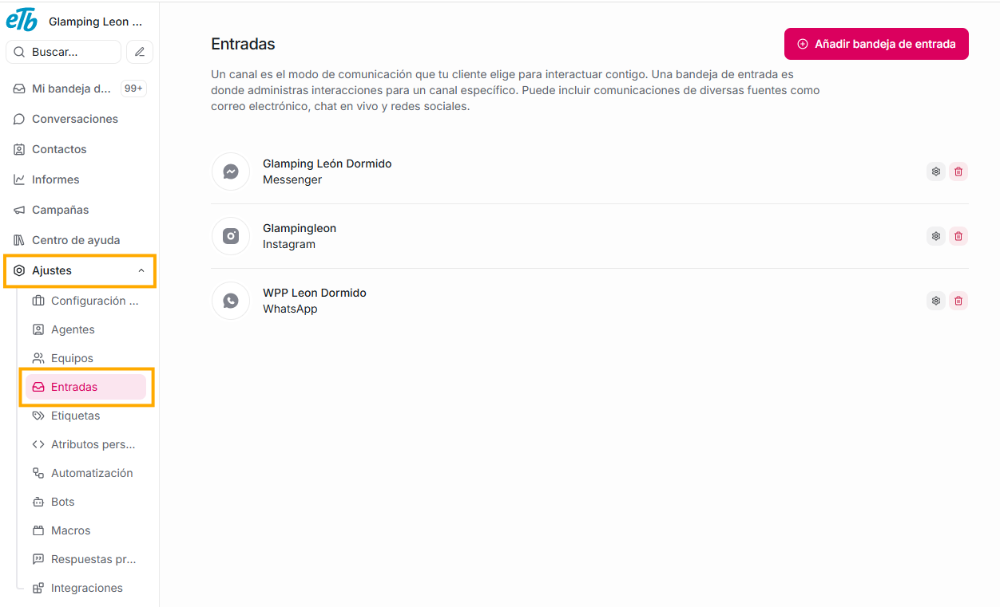

Aquí configuras **los canales por donde llegan los mensajes**:

- WhatsApp

- Instagram

- Facebook Messenger

- Correo (Email)

- Live Chat (el widget de tu página)

- SMS

- API

- Telegram
- Line

Cada canal se considera una **entrada (inbox)**.

**Qué puedes hacer aquí:**

- Crear nuevos canales.

- Configurar integraciones.

- Ver y editar ajustes del widget de chat (si tienes uno).

Si queremos agregar un nuevo canal, debemos dar click en el botón **Añadir bandeja de entrada**

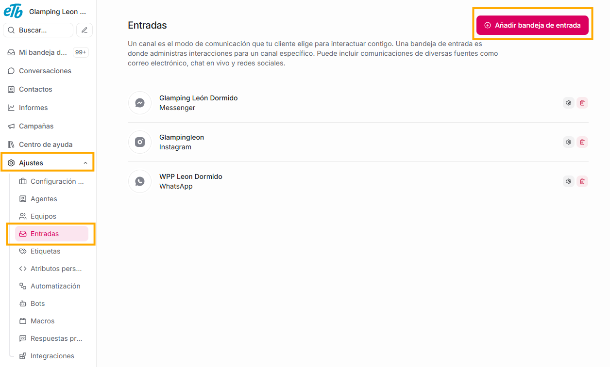

Una vez lo hagas, verás todos los canales que puedes integrar a tu plataforma.

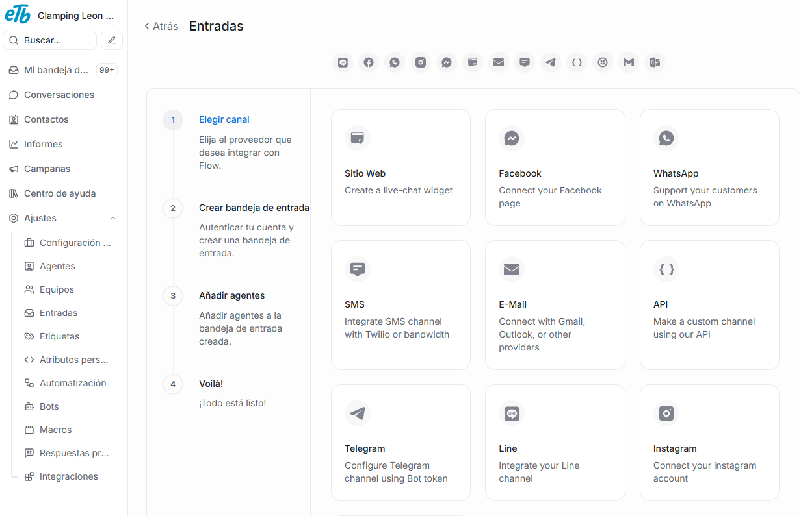

Debes seleccionar el que quieres adicionar, y comenzar a seguir los debidos pasos, de acuerdo a lo que requiere el canal de tu elección.

## **¿Cómo enlazar un whatsapp a Agentes virtuales ETB?**

Antes de iniciar, es importante tener en cuenta que aunque vamos a conectar Whatsapp a la plataforma, para esto es necesario tener una cuenta activa de facebook. En un punto del proceso tendremos que iniciar sesión allí.

1. Damos click en el botón **"Añadir bandeja de entrada"**

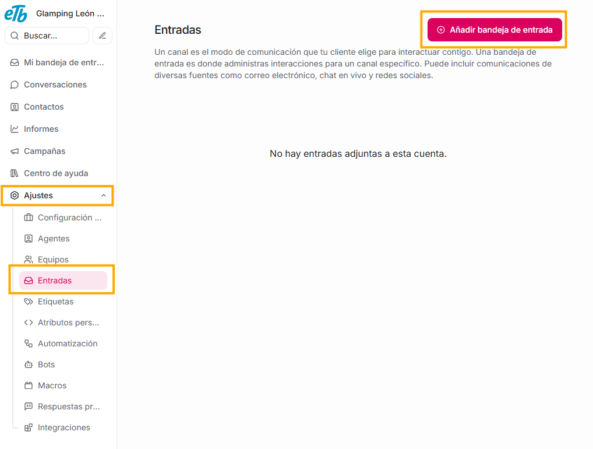

2. Seleccionamos el canal que queremos integrar, para este ejemplo: whatsapp

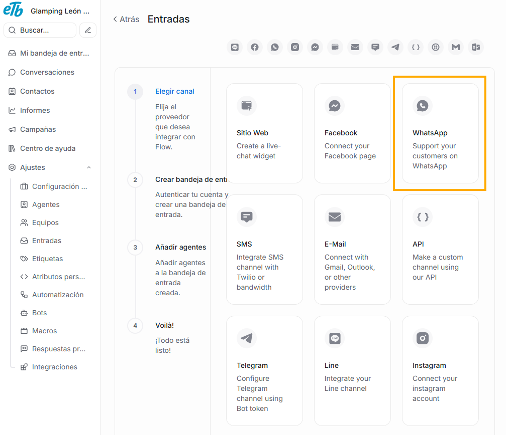

3. Elegimos la opción **Nube de whatsapp**

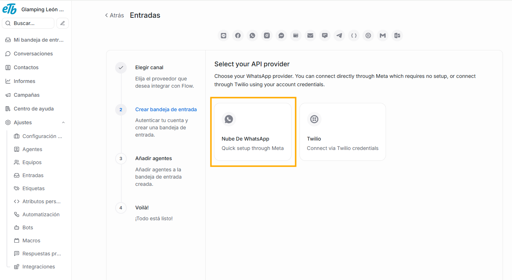

4. Damos click en el botón **Connect with WhatsApp Business**

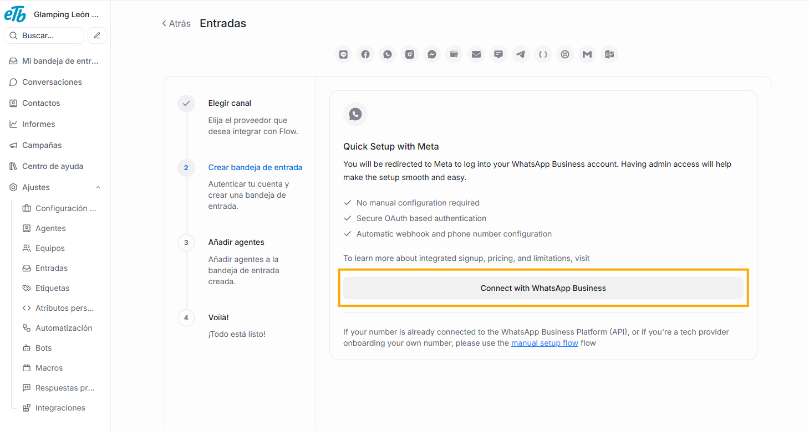

5. Nos redirigirá a la página de inicio de sesión de facebook. Debes ingresar las credenciales y logearte.

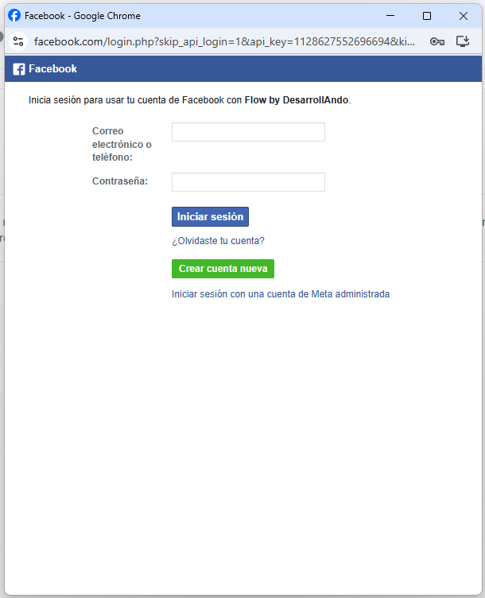

6. En la página de facebook, damos click en el botón "Continuar"

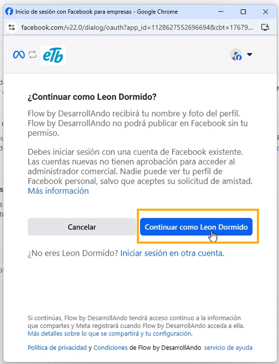

7. Damos click en el botón **Empezar**

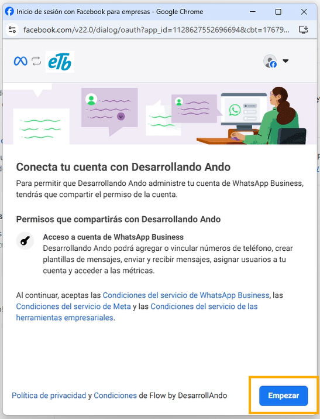

8. Diligenciamos los datos del formulario. En el campo **sitio web** ponemos el enlace del facebook de nuestra empresa. Al completar todos los campos damos click en el botón **siguiente**

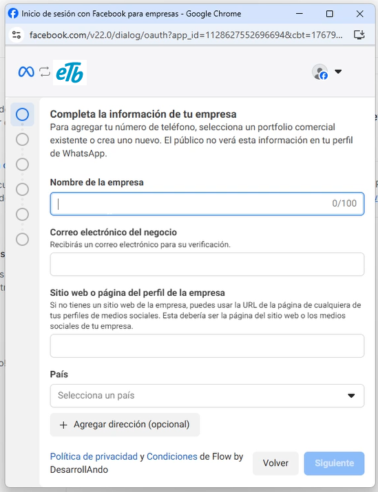

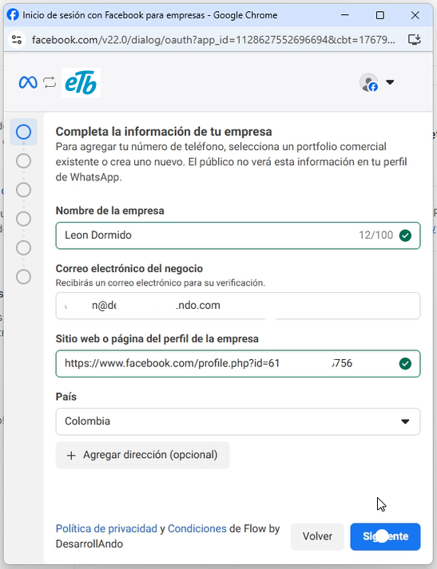

9. Si previamente ya tenemos instalada la aplicación de **whatsapp business** y la hemos utilizado, seleccionamos la opción **Conecta tu app de Whatsapp Business existente**, pero si no es tu caso, puedes elegir la opción **Empieza con un nuevo número de teléfono de whatsapp**. Una vez hemos elegido la opción indicada, damos click en el botón **siguiente**.

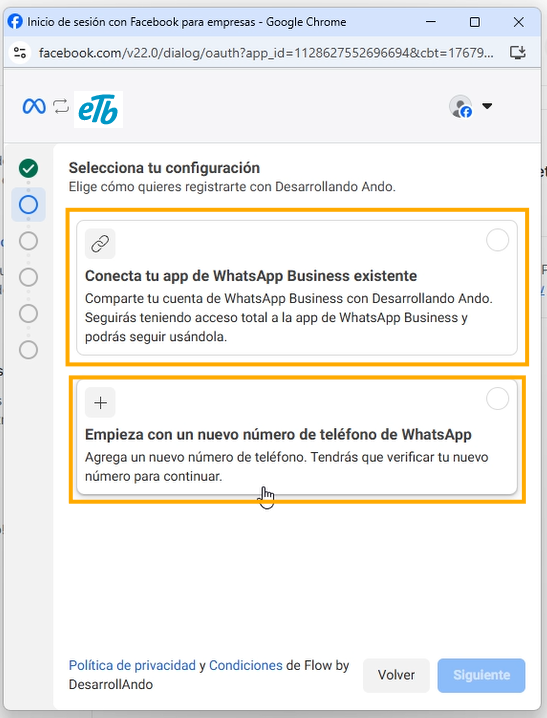

10. En las opciones de lista desplegable que visualizaremos a continuación, elegimos la única opción disponible de cada campo.

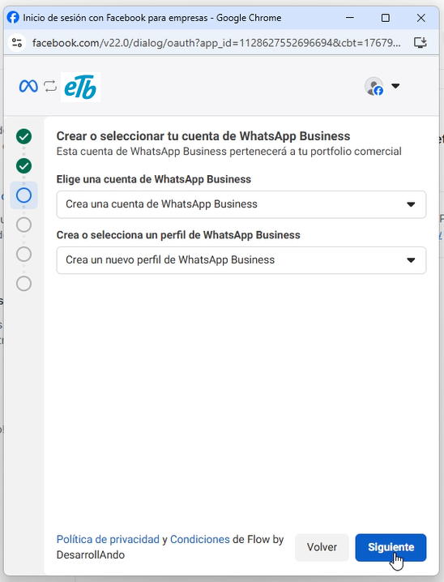

11. Digitaremos el nombre que queremos que tenga esta nueva línea de atención y elegiremos la categoría de acuerdo a la actividad económica de nuestra compañia. Al completar los datos damos click en el botón **Siguiente**.

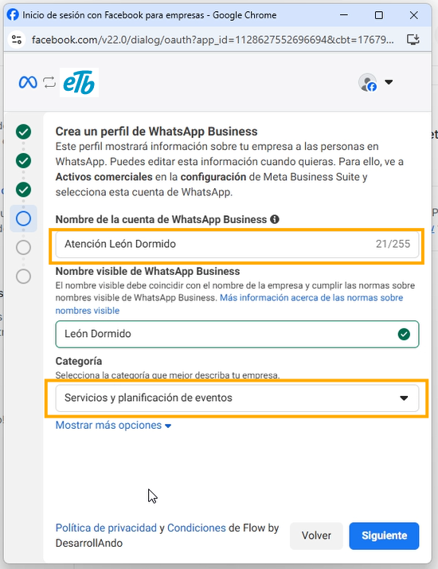

12. Elegimos la opción **Agregar un número nuevo**, escribimos el número de whatsapp que estamos enlazando y elegimos el método por el que recibiremos el código para verificar nuestro número y damos click en **Siguiente**

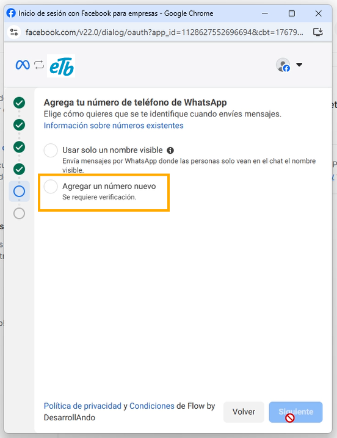

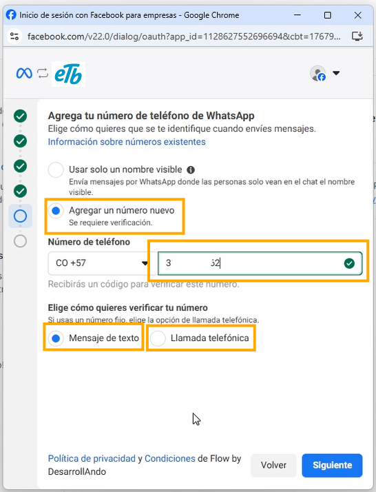

13. Ingresamos el código de verificación que recibimos por el método que elegimos en el paso anterior.

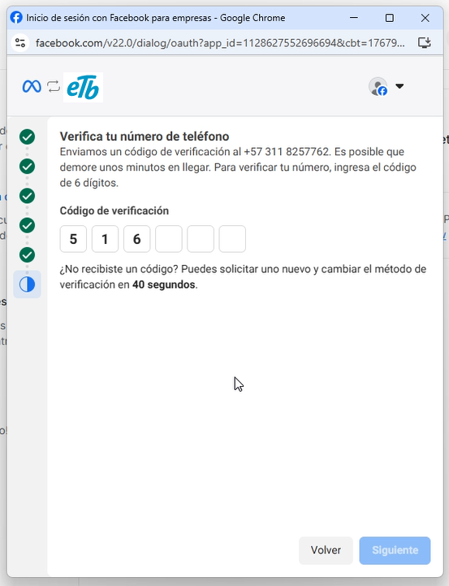

14. En la pantalla que vemos damos click en **Confirmar**.

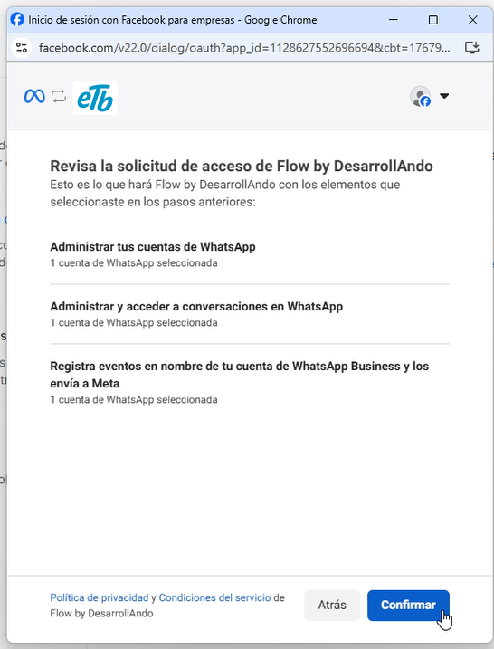

15. Por último, veremos la siguiente pantalla mientras Meta completa el proceso:

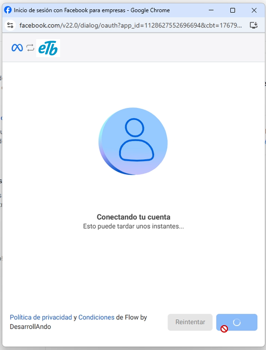

y luego podremos dar click en el botón **Finalizar**

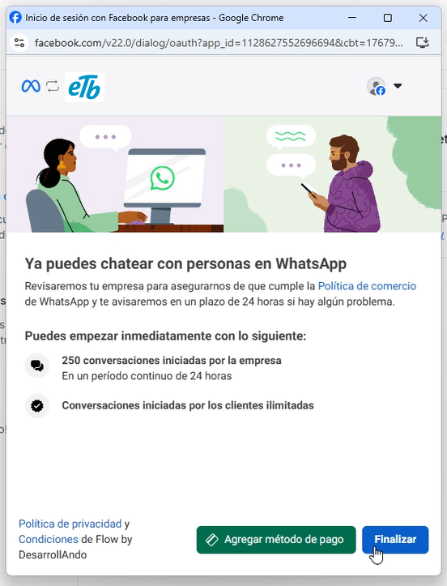

16. Al completar este proceso, verás tanto en el submenú de **canales** de esta sección de ajustes, como en el módulo de Conversaciones, tu canal de whatsapp habilitado. En adelante, todos los mensajes que te escriban al número de whatsapp que acabas de vincular, los verás y podrás gestionar desde tu plataforma.
