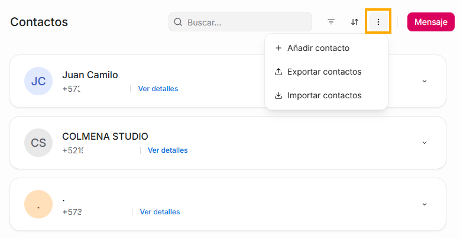
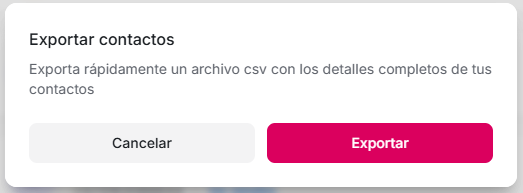
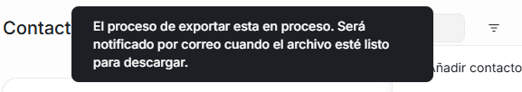
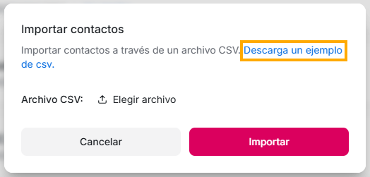

Si deseas exportar los contactos puedes hacerlo de forma rápida, a través del siguiente paso a paso:

En la parte superior del módulo de Contactos, verás 3 puntos, si das click allí te brindará las siguientes opciones:

1. Añadir contacto
2. Exportar contactos
3. Importar contactos

## Exportar contactos

Si das click en la opción de exportar contactos, verás la siguiente notificación:

Si estas seguro de que deseas exportarlos, puedes dar click en el botón “Exportar”, una vez lo hagas, verás la siguiente notificación en la parte superior de la plataforma. Solo debes esperar unos minutos y recibirás en el correo con el que te logueas, un archivo tipo excel que tendrá una tabla con toda la información que tienes de todos tus contactos.

## Importar contactos

Si lo que deseas es subir a tu plataforma de Flow toda una base de datos de contactos con la que ya cuentas, solo debes dar click en la opción de Importar contactos, y a continuación verás el siguiente mensaje

Es importarte que el archivo que vas a subir sea igual al que te compartimos en el ejemplo que puedes descargar dando click en el mensaje “Descarga un ejemplo de csv” que ves en la notificación. Puedes reemplazar este mismo archivo con los datos que ya tienes, y una vez lo tengas listo solo debes dar click en “Elegir archivo” para que lo subas desde tu equipo, y luego en “Importar”.
