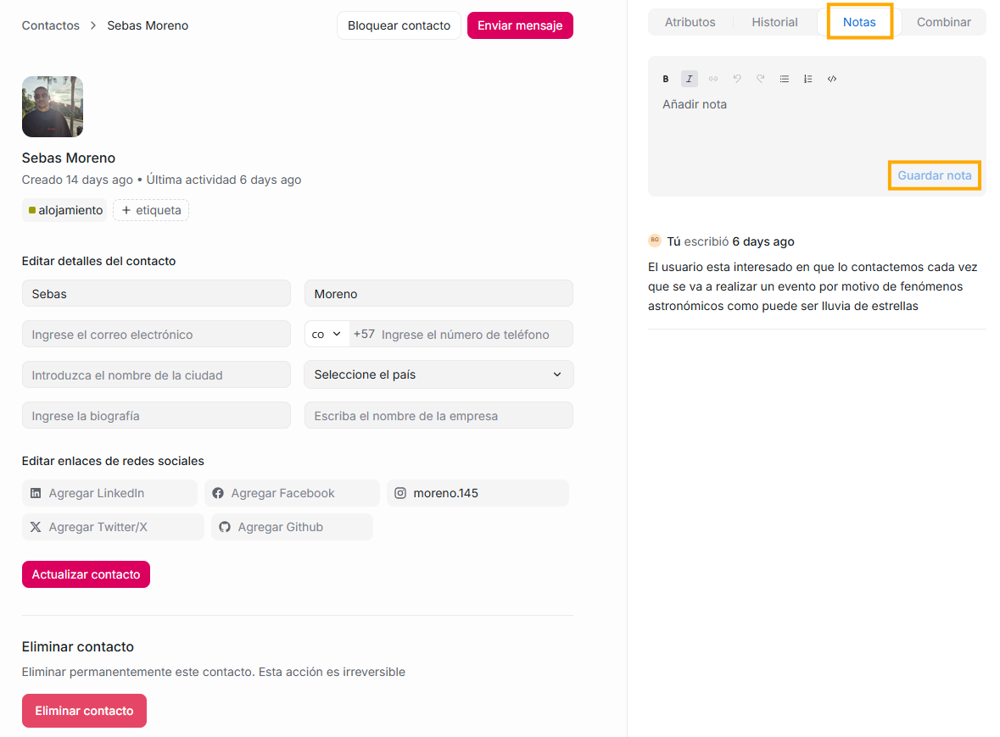

Las Notas de contacto son una herramienta para que los agentes puedan guardar información interna sobre un cliente. No son visibles para el cliente y solo sirven para uso del equipo.

Son **anotaciones internas** que puedes agregar dentro del perfil de un contacto. Funcionan como _post-its digitales_ para recordar datos importantes sobre esa persona.

Se usan para registrar información útil que ayuda a cualquier agente que interactúe después con ese mismo contacto.

Por ejemplo:

- “Cliente muy sensible con los tiempos de respuesta”

- “Ha comprado 3 veces, valora mucho explicaciones detalladas”

- “Tiene pendiente un reembolso”

- “Prefiere atención por WhatsApp”

- “Pidió que no se le llame en horarios laborales”

Son útiles ya que nos ayudan a:

- Mantener la misma calidad de atención entre diferentes agentes.

- No repetir preguntas al cliente.

- Tener historial más allá de los mensajes enviados.

- Dar soporte más rápido y más personalizado.
- Cualquier agente con acceso al contacto puede ver las notas al abrir el perfil del contacto en el panel lateral.

- Las notas sirven como historial y contexto para futuras interacciones.

### **Cómo crear una nota:**

En la parte superior del panel de contacto, verás un icono de flecha ↗ / un botón que abre la ficha. Haz clic allí.

Esto te lleva a la página completa del contacto. En esta página aparece:

- Información del contacto

- Atributos

- Historial

- Notas

- Combinar

En esta sección podrás crear y guardar las notas.

