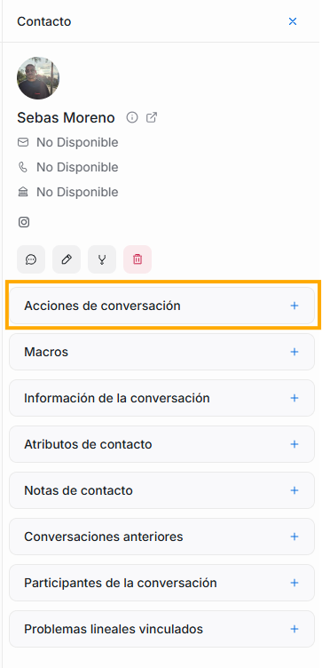
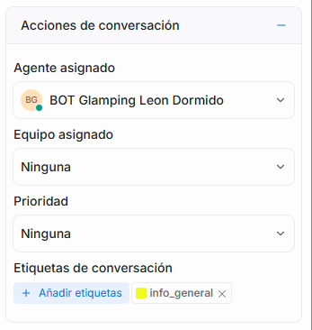
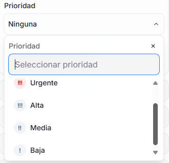

Al dar click en el ícono de \+ de esta opción, se desplegarán 4 opciones:

1. #### Agente asignado

Encontrarás la lista de todos los agentes que tienes disponible, si seleccionas uno de ellos, la conversación en la que estás será delegada al agente que elijas. A través de esta opción, se garantiza que cada conversación tenga un responsable directo de la comunicación y seguimiento con el cliente, personalizando la atención.

2. #### Equipo asignado

Esta opción te permite asignar o reasignar la conversación a un equipo de trabajo en particular (por ejemplo, "Soporte Técnico" o "Ventas"). Esto es útil para categorizar el tipo de asistencia requerida y dirigir la conversación al grupo de expertos adecuado, especialmente cuando la conversación se libera o es nueva. Solo debes seleccionar una opción de la lista desplegable.

3. #### Prioridad

Al dar click sobre ella, verás una lista desplegable con 5 opciones:

Esta selección te permite establecer un nivel de urgencia o importancia para la conversación. Al asignar una prioridad (por ejemplo, "Alta," "Media," "Baja"), tu equipo puede identificar y atender primero los casos más críticos, administrando de mejor manera el flujo de trabajo. Ten en cuenta que aquí puedes asignarle el valor a la conversación que tienes abierta, pero si por ejemplo lo que necesitas es que en el segundo panel la lista que se muestre sea solamente de conversaciones a las que les hayas asignado prioridad urgente, puedes dirigirte a la explicación del segundo panel y ajustar los filtros de acuerdo a lo que allí te explicamos.

4. #### Etiquetas de conversación

Permite agregar o modificar tags (etiquetas) a la conversación para categorizar el tema o la naturaleza de la consulta (por ejemplo, "Facturación", "Reservas", "Reclamo"). Esto facilita la búsqueda, el filtrado y el análisis posterior de las conversaciones.

Solamente debes dar click en el botón “Añadir etiquetas” y se desplegará una lista con todas las que tu sistema tiene establecidas, al seleccionar una de la lista, se asignará a la conversación que tienes abierta. Puedes agregar más de una etiqueta por conversación. Sabrás cuáles etiquetas están asignadas a una conversación porque tendrán un chulito azul junto al nombre de la etiqueta y porque aparecerán como lista debajo del botón de “Añadir etiquetas”. Si deseas quitar una de las etiquetas que asignaste, lo puedes hacer en este mismo lugar, solo debes dar click en la x que aparece al final del nombre de la etiqueta asignada.

Recuerda que de acuerdo a la etiqueta que asignes a tus conversaciones, estas aparecerán clasificadas en la sección de Etiquetas, del lateral izquierdo de Flow. Para más detalles de este punto, puedes visitar la explicación del primer panel.
