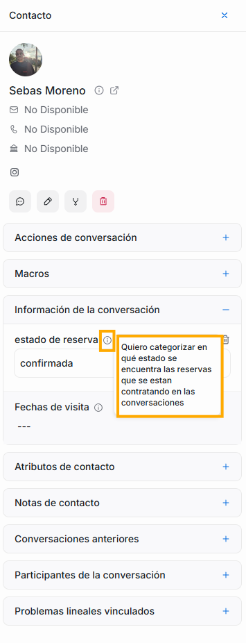
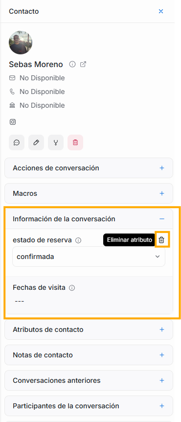

Aquí verás la lista de todos los atributos de conversación que esten configurados en tu plataforma - para saber cómo crear, editar o eliminar atributos de conversación, lo hemos explicado a detalle en la sección de **Ajustes**, **Atributos personalizados**.

Si quieres saber de qué trata cada uno, solo debes pasar el mouse encima del ícono de **i** que está junto al nombre de cada atributo, y así podrás ver la descripción del atributo.

Si quieres quitar un atributo que ya asignaste a una conversación, solo debes dar click en el ícono de basura que esta al final del nombre del atributo.

