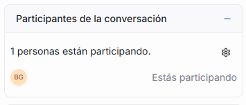

Aquí puedes ver todas las personas que están involucradas en la conversación, como por ejemplo, el agente asignado.

Esta sección te permitirá conocer quién está participando en esa conversación y permite acciones como:

- Ver si un bot está activo
- Ver si hay varios agentes involucrados
- Añadirte como participante: No necesitas hacerlo manualmente, Agentes Virtuales ETB te agrega automáticamente como participante si escribes en la conversación.
- Cambiar el agente asignado seleccionando el nuevo agente.

  
