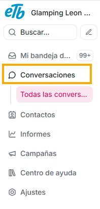
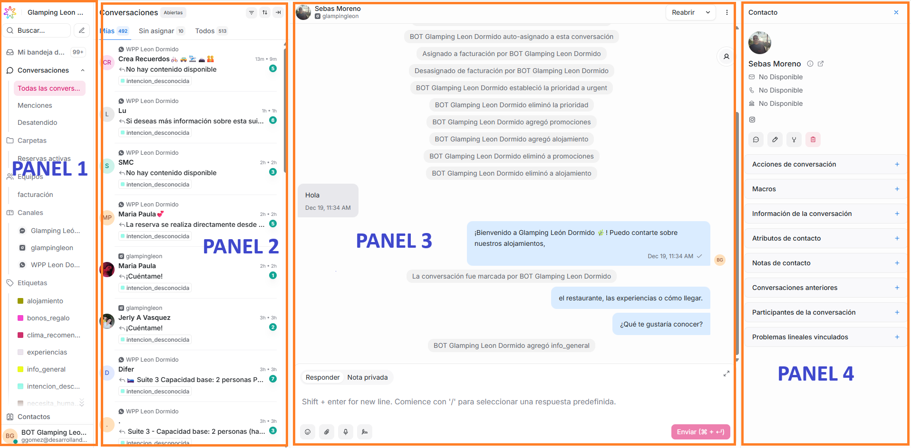

En el menú lateral izquierdo, verás la opción **Conversaciones.**

Es en esta sección que podrás interactuar con los mensajes que recibes. Aquí te contaremos cómo está organizada la información que encuentras allí, y cómo podrás hacer las siguientes acciones:

- Responder mensajes
- Asignar conversaciones entre tus agentes
- Usar notas internas
- Etiquetar
- Cerrar correctamente conversaciones
- Ver el historial del cliente
  Entre muchas otras más.

Para un mejor entendimiento de los filtros que puedes aplicar para acceder a la conversación que desees, desglosamos en 4 paneles la explicación de la bandeja de conversaciones, de la siguiente manera:

