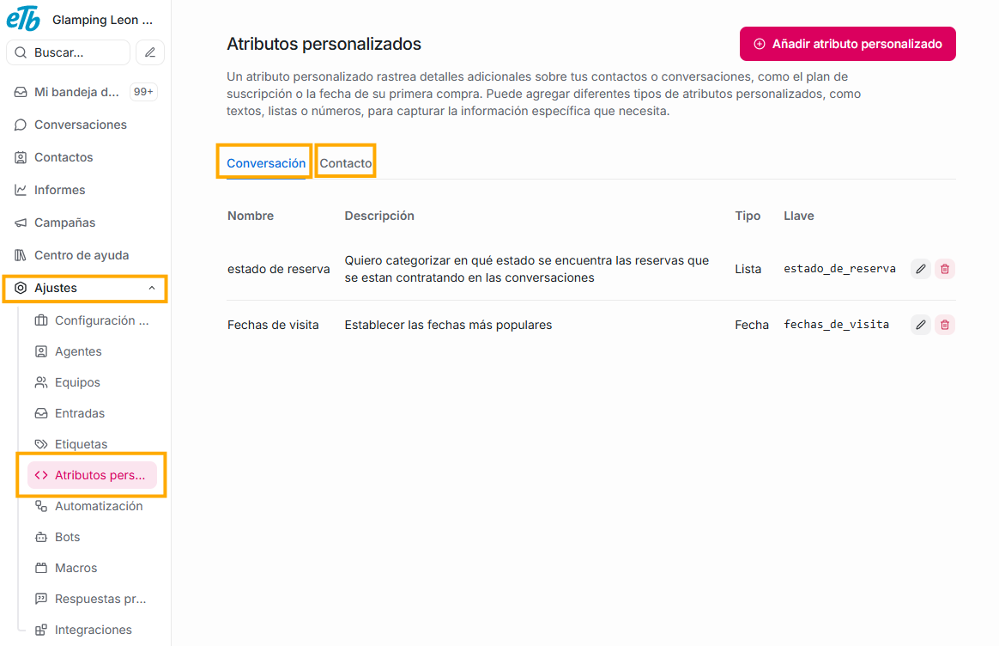
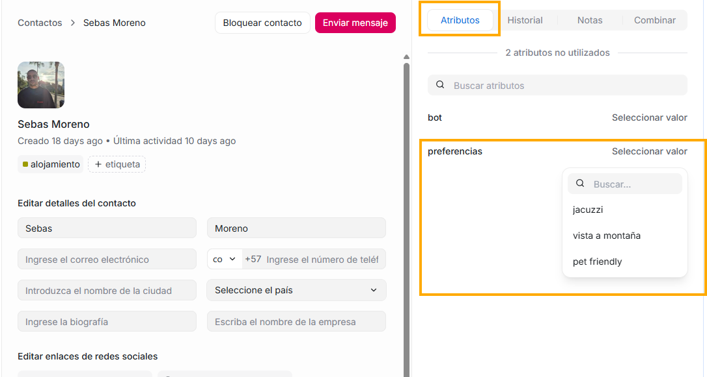
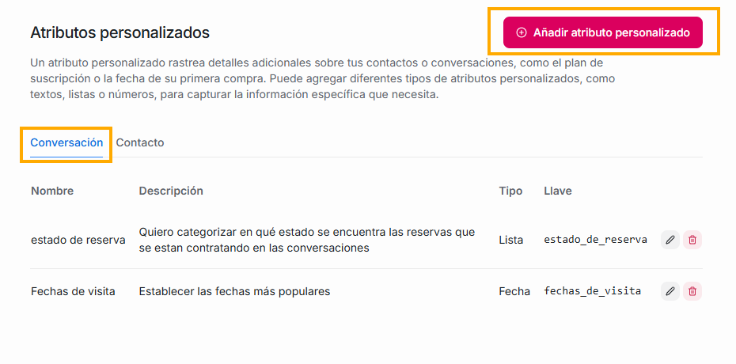
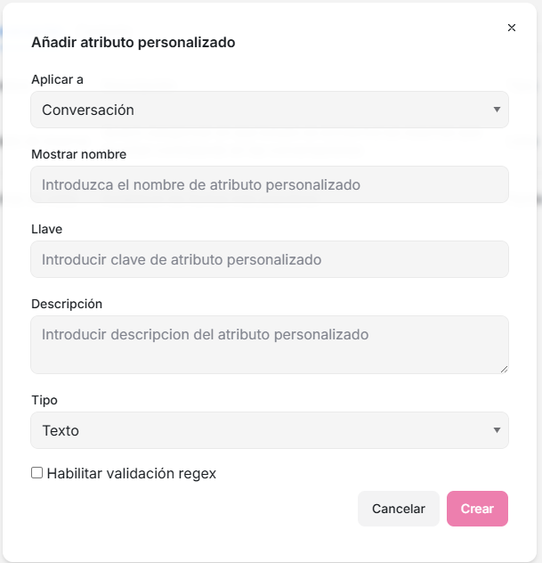
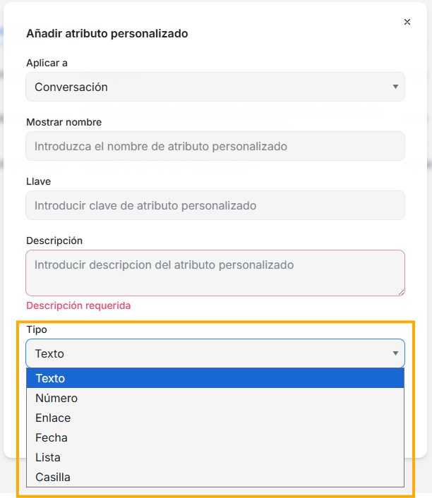
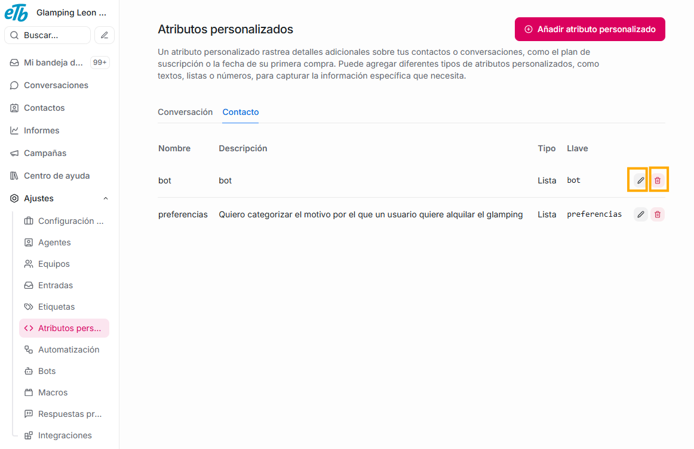

Podríamos definir los atributos de la plataforma Agentes Virtuales ETB, como campos que te permiten describir información estructurada. Tu plataforma inicialmente no tendrá ningún atributo, estos podrán ser creados, editados, eliminados, y en general, ser administrados por ti mismo, de acuerdo a las necesidades de tu negocio. Puedes crear atributos tanto para **Conversaciones** como para **Contactos**; cada uno de estos cumplirá funciones distintas y te serán utiles en diferentes sitios de la plataforma. Te serán de gran ayuda para categorizar y perfilar aún mejor a tus conversaciones y a los usuarios con los que interactuas.

Como hay dos diferentes tipos de atributos, idetificarás en cual de los dos estas porque el seleccionado tendrá las letras del título en color azul.

## **Atributos de conversación**

Los atributos de conversación sirven para agregar información contextual a una conversación específica. Te ayudarán a clasificar, automatizar y dar seguimiento ya que los atributos de conversación que tu crees aparecerán en:

- **Los filtros del segundo panel:** es decir, que tus propios atributos te ayudarán a crear filtros personalizados para seleccionar las conversaciones en las que te quieras enfocar. Para saber en donde y como aprovecharlos de esta manera, te invitamos a explorar la explicación que hacemos sobre el segundo panel, en este mismo manual.

- En el submenú **Información de la conversación** del cuarto panel: allí estará la lista de todos los atributos de conversación que hayas creado, y podrás asignarle una descripçión específica de cada atributo a la conversación seleccionada. De igual manera, te invitamos a visitar la explicación de este submenú, que encontrarás en la sección "Cuarto panel" del presente manual.

### **Ejemplo de uso**

Por ejemplo, si mi empresa es un glamping, y quiero clasificar las conversaciones de acuerdo a los usuarios que ya reservaron, o quienes estan a punto de hacerlo, puedo crear mi **atributo personalizado de conversación** llamado "estado de reserva", y hacer que este atributo tenga tres opciones:

- Confirmada
- En proceso
- Cancelada

Así entonces, en el submenú "Información de la conversación" asigno una de estas opciones a cada conversación, y cuando quiera filtrar todas mis conversaciones de acuerdo a este concepto (por ejemplo, si solo quiero ver las conversaciones cuyo estado de reserva esta "en proceso"), lo podré hacer creando un filtro en el segundo panel.

## **Atributos de contacto**

Los atributos de contacto son campos personalizados que te permiten guardar información adicional del cliente más allá de los datos básicos. Te servirán para enriquecer el perfil del contacto, segmentar, automatizar y dar mejor contexto a los agentes durante una conversación. Los atributos que crees en esta sección podrás verlos y usarlos en:

- **En el módulo de contacto**, al abrir la información de cada usuario allí registrado, verás la sección **Atributos**, en esta aparecerán todos los atributos de **contacto**, para que, de acuerdo a estos, le puedas asignar un valor de acuerdo a tu cliente, o puedas modificarlo. (Recuerda que para ampliar esta información, puedes visitar la explicación que tenemos sobre el módulo de contacto en este manual)

- En el submenú **Atributos de contacto** del cuarto panel. (Puedes ampliar esta información en la sección que tenemos disponible sobre este submenú )

### **Ejemplo de uso**

Continuando con el ejemplo del glamping, puedes clasificar el tipo de huésped que es tu cliente:

- Amigos
- Familia
- Pareja

o lo puedes clasificar de acuerdo a sus preferencias:

- Vista a la montaña
- Pet friendly
- Jacuzzi

Esta información posteriormente te será de ayuda cuando quieras crear campañas, o automatizaciones.

## **¿Cómo crearlos?**

**Para crearlos** solo debes dar click en el botón **Añadir atributo personalizado** que ves en la parte superior de esta sección. Es importante que te fijes si estas en la pestaña del atributo que quieres crear (recuerda que hay 2 tipos: conversación y contacto), sabrás en cual de los dos estas de acuerdo al que tenga las letras de color azul.

Al dar click allí, verás el siguiente formulario:

- El primer campo: **Aplicar a**, te permite elegir nuevamente si quieres que este atributo sea de conversaicón o de contacto.
- En el segundo campo: **Mostrar nombre**, puedes asignarle a tu atributo el nombre que consideres pertinente. Recomendamos que sea un título muy corto, si es posible una sola palabra o máximo tres.
- El tercer campo: **Llave**, notarás que no tendrás que llenarlo tu, sino que automáticamente cuando creas el nombre, la llave se creará. Esta llave será la que aparecerá en los lugares en donde puedas usar los atributos.
- El cuarto campo: **Descripción**, te será super útil ya que en la medida en la que crees atributos y la lista sea más larga, los agentes tal vez no sepan de qué trata cada uno de ellos, y éste desconocimiento no permita que se pueda sacar provecho a estos. La descripción que crees aquí será visible de forma fácil en en el **submenú "Información de la conversación"**, ya que allí, al pasar el mouse sobre cada atributo, aparece la descripción de cada uno, por tal motivo, lo que pongas en este campo será de gran ayuda cada vez que tu atributo vaya a ser usado.
- En el campo **Tipo**: si das click sobre la flecha hacia abajo que aparece al final del campo, aparecerá una lista con 6 opciones:

## **Opciones campo tipo:**

### **1. Texto:**

Es un campo libre donde se puede escribir cualquier cosa.

Ejemplo:

- Motivo del contacto
- Observaciones del agente
- Nombre de un producto
- Comentarios internos

**Cuándo podrías usarlo:**

- Cuando la información no tiene opciones fijas
- Cuando el agente debe escribir libremente
- No es ideal para reportes, porque cada persona puede escribir algo distinto.

### **2. Número:**

Es un campo que solo acepta valores numéricos.

Ejemplos

- Número de pedido
- ID de ticket
- Monto de una compra
- Número de contrato

**Cuándo podrías usarlo:**

- Cuando el dato siempre es numérico

### **3. Enlace:**

Es un campo para guardar URLs (links clicables).

Ejemplos

- Link a una factura
- Link a un ticket en Jira
- Link a documentación
- Link a Google Drive

**Cuándo podrías usarlo:**

- Cuando quieres acceder rápido a recursos externos

### **4. Fecha:**

Es un campo para almacenar una fecha específica.

Ejemplos

- Fecha compromiso de respuesta
- Fecha de vencimiento
- Fecha de seguimiento
- Fecha de cierre estimada

**Cuándo podrías usarlo:**

- Para SLA y control de tiempos
- Para recordatorios o métricas

### **5. Lista:**

**Es el tipo más recomendado para usar al crear un atributo, ya que con este puedes crear un dropdown con opciones predefinidas.**

Ejemplos

Tipo de solicitud:

- Soporte
- Ventas
- PQRS

Estado del caso:

- Abierto
- En gestión
- Cerrado

**Cuándo podrías usarlo:**

- Cuando quieres datos consistentes
- Para automatizaciones, filtros y reportes

### **6. Casilla:**

Es un valor Sí / No (booleano).

Ejemplos

- ¿Requiere escalamiento?
- ¿Cliente molesto?
- ¿Es urgente?
- ¿Caso resuelto?

**Cuándo podrías usarlo:**

- Para decisiones rápidas
- Para reglas automáticas

Ejemplo:

- Si Requiere escalamiento = Sí -> entonces asignar a equipo nivel 2

Por último, verás una casilla llamada **Habilitar validación regex**, si la activas, forzará a que el valor ingresado cumpla un formato específico, usando una expresión regular (osea aplica una regla que define cómo debe verse el texto que el usuario o agente va a ingresar. Agentes Virtuales ETB valida el valor antes de guardarlo y si éste no cumple el patrón, no lo dejará guardar.), es decir que evita que se guarden datos mal escritos o inconsistentes.

Por ejemplo, si vas a guardar un número celular en Colombia, éste tiene siempre 10 dígitos, la validación regex verifica si el número que se esta guardando tiene más o menos dígitos que 10, y si no cumple esta norma, no permitirá que se guarde el número.

Esta validación te podría servir si tu atributo es de tipo texto, número o enlace. Pero por ejemplo si es de tipo lista, casilla o fecha, no es consistente que apliques una validación regex

## **¿Cómo editarlos o eliminarlos?**

Si ya creaste un atributo y posteriormente quieres **editarlo**, solo necesitas dirigirte nuevamente a esta sección de Ajustes, seleccionar - Atributos personalizados, buscar el que quieres modificar, y dar click en el ícono de lápiz, allí te mostrará el mismo formulario con el que lo creaste y solo necesitarás hacer los ajustes que requieras y por último dar click en el botón "Actualizar".

O si lo que deseas es **eliminarlo**, puedes hacerlo dando click en el ícono de basura.

