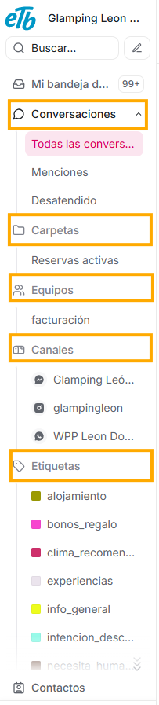

**Dato importante: Para poder aprovechar lo que explicaremos en este panel, debes tener en cuenta que todo lo que verás respecto a filtros y opciones, será de acuerdo a las credenciales con las que te logueaste, por tanto, a tu rol y a lo que se te ha designado como agente.**

Si das click en la palabra **Conversaciones** del menú lateral izquierdo, verás que debajo de esta opción se desplegarán varios submenús; la cantidad de submenús que te salgan dependerá de cómo este configurada tu plataforma. De acuerdo a la opción que selecciones en este primer panel, es que verás la lista de conversaciones del segundo panel. En esta sección del menú te explicaremos a detalle cada uno de los submenús del primer panel, y sus correspondientes opciones.

### **1. Submenú Conversaciones:**

El primer submenú esta compuesto por las opciones que vemos debajo de la palabra **Conversaciones**:

- Todas las conversaciones,
- Menciones y
- Desatendido.

Este submenú siempre esta disponible, independientemente de cómo este configurada tu plataforma. Te explicamos cada una de sus opciones a continuación:

- **Todas las conversaciones:** como lo indica su título, aquí visualizarás todas las conversaciones que están en la plataforma de tu negocio, pero es importante que tengas en cuenta que esto también dependerá del filtro **Ordenar Conversaciones** que te explicaremos en el Segundo panel.
- **Menciones:** Si seleccionas este filtro, verás las conversaciones que están a cargo de otros agentes, pero en las que has sido solicitado por alguna razón.
  Te lo explicamos más a profundidad para que si lo requieres, también puedas mencionar a tus compañeros agentes en las conversaciones que estan bajo tu responsabilidad: Agentes Virtuales ETB permite mencionar agentes en conversaciones, esto quiere decir que puedes llamar a un agente si es requerido, a través de la siguiente estructura: **@nombre_del_agente**; por ejemplo, si un agente que ya está atendiendo una conversación requiere del apoyo de otro agente para un tema en específico, empleando la estructura **@nombre_del_agente** está indicando que cierto tema en particular debe ser revisado por la persona mencionada. Esto permite que se pueda coordinar trabajo entre agentes sin perder contexto. Un ejemplo de mención puede ser: “@Marcelo ¿puedes verificar este caso del cliente?”; de acuerdo a este último ejemplo, si tu eres el agente Marcelo, entonces al seleccionar este filtro, verás en la lista del segundo panel, esta conversación.

- **Desatendido:** aquí aparecen las conversaciones que ya comenzaron, pero que actualmente no están siendo atendidas por ningún agente. Esto puede ocurrir cuando un cliente escribe por primera vez, cuando la conversación se asigna automáticamente a una bandeja de equipo y nadie la toma, o cuando un agente asignado la libera o cierra sesión sin resolverla. Este filtro permite que el equipo identifique rápidamente los mensajes sin atención y les asigne un responsable, antes de que el cliente espere demasiado.

### **2. Submenú Canales:**

Debajo del título **Canales**, verás una lista con los medios de comunicación que tienes enlazados a tu APP de Agentes Virtuales ETB: Instagram, whatsapp, messenger, etc. Así entonces, a través de este filtro, verás discriminadas las conversaciones dependiendo del canal desde donde el cliente te está escribiendo.

Este submenú también esta disponible independientemente de cómo tengas configurada tu plataforma.

**Los submenús que te explicaremos a continuación, sí dependerán de las configuraciones que hagas.**

### **3. Submenú Etiquetas:**

Este submenú solo será visible si en tu plataforma tienes creadas Etiquetas (para que conozcas cómo crearlas y administrarlas, puedes visitar la sección de Ajustes, la explicación de "Etiquetas") Este submenú esta compuesto por una lista con todas las **etiquetas** que existen en tu plataforma. Si seleccionas una de ellas, se mostrarán en el segundo panel únicamente las conversaciones a las que les has añadido esta etiqueta.

### **4. Submenú Equipos:**

Al igual que con la opción anterior, este submenú solo lo verás si en tu plataforma existen **Equipos** (para conocer más sobre esta opción que te ofrece Agentes Virtuales ETB, puedes dirigirte en este manual a la sección de "Ajustes", y elegir "Equipos"). Si aún no tienes ningún equipo creado, este submenú no estará disponible en este primer panel de Conversaciones, pero si sí existen, verás una lista de todos lo equipos, y al seleccionar uno, en el segundo panel estarán visibles las conversaciones que han sido asignadas al equipo elegido.

### **5. Submenú Carpetas:**

Este submenú también es visible únicamente cuando, desde el **segundo panel**, se crea un **filtro personalizado**. Es decir, que si de acuerdo a las necesidades de tu empresa se considera conveniente filtrar las conversaciones de acuerdo a ciertos parámetros, entonces cada uno de estos filtros aparecerá en el submenú **Carpetas**. En la explicación del segundo panel te contaremos cómo crear estos filtros especializados, cuando hablemsos del **ícono Filtrar conversaciones.**
