Este último panel solo lo visualizarás cuando hayas seleccionado una conversación en específico.

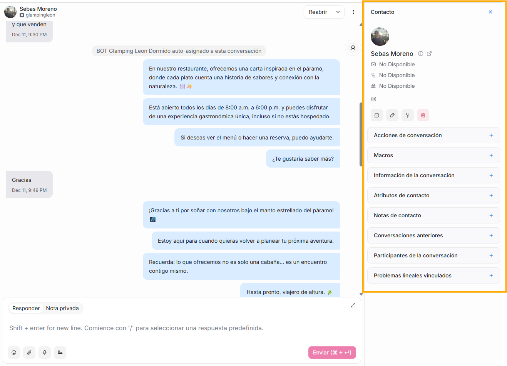

Si deseas que este panel no sea visible, puedes dar click en la X ubicada en la esquina superior derecha para cerrarlo:

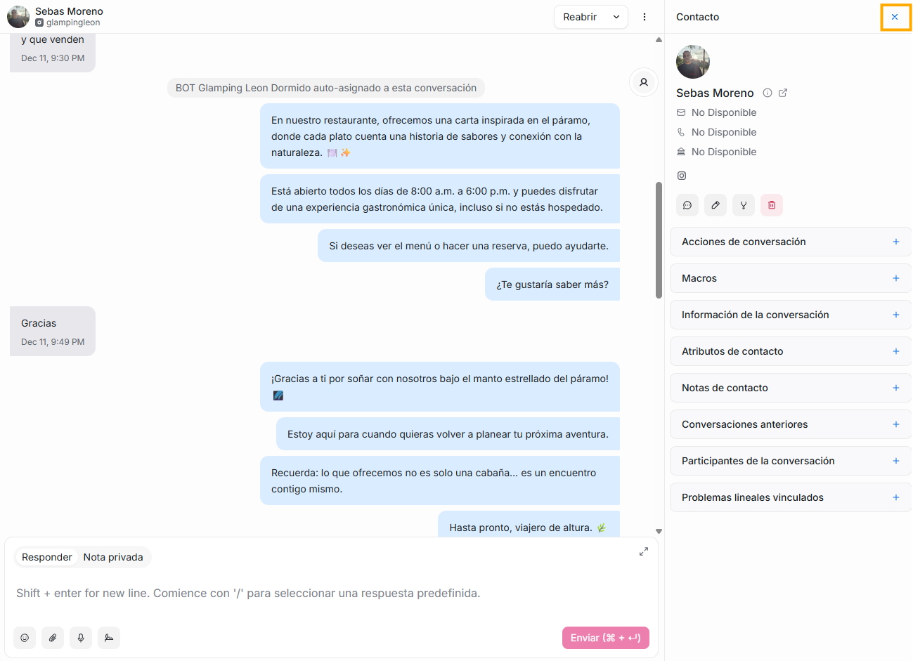

Y si está cerrado y lo deseas volver a abrir, puedes dar click en el ícono que está en la parte superior derecha de la conversación, de esta forma, se volverá a desplegar este panel de contacto.

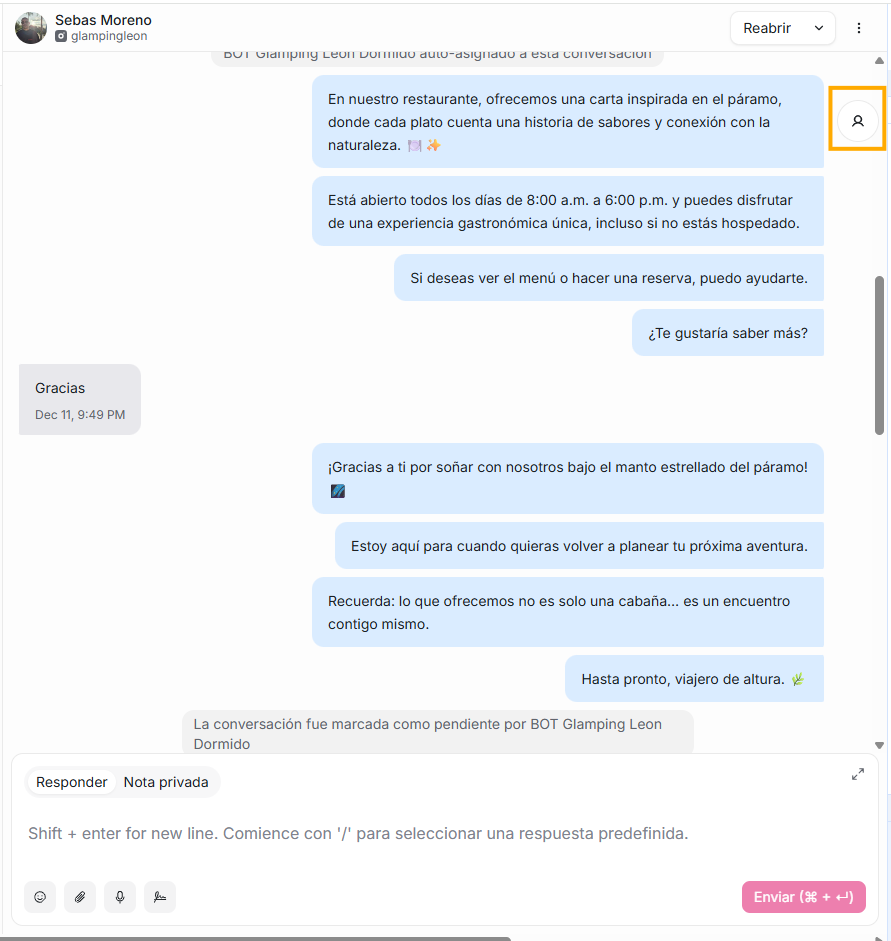

Este panel te será de ayuda ya que te permitirá tener un contexto completo del cliente de la conversación seleccionada.

En la parte superior, estará un avatar o foto del usuario de la conversación, su nombre, y al lado de éste, 2 íconos:

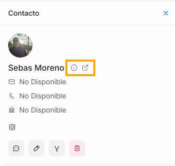

- Si pasas el mouse sobre el primer ícono, verás hace cuanto tiempo fue creado este contacto en Flow

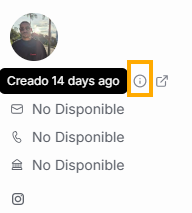

- Si das click sobre el segundo ícono, se abrirá una nueva ventana que te ubicará en la sección de contactos de Flow. Allí, podrás editar la información del usuario con el que estás conversando.

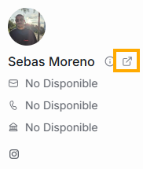
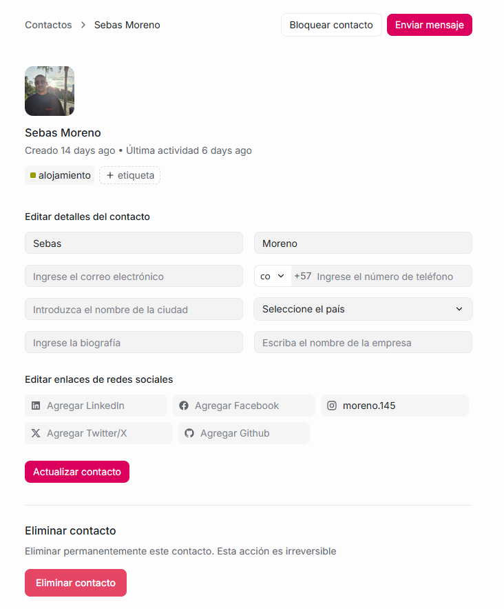

Debajo del nombre del contacto, estarán los datos de correo, teléfono, dirección y red social, que pueden ser diligenciados manualmente o aparecerán automáticamente allí si la conversación se originó desde ese medio, es decir, por ejemplo, si un contacto nos escribe desde su instagram, aparecerá el logo de instagram en esta lista de datos, pero si nos escribe desde whatsapp, aparecerá el número de celular de la persona junto al ícono del teléfono.

Al final de esta sección de datos, verás 4 íconos:

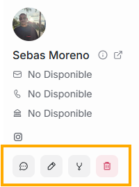

Cada uno te permitirá:

Si das click en este ícono, podrás crear una nueva conversación:

Al dar click sobre el segundo ícono:

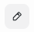

Se abrirá un panel de la sección de “Contactos” para que puedas editar información del usuario. Puedes cerrarlo dando click en el icono X que se visualiza en la esquina superior derecha.

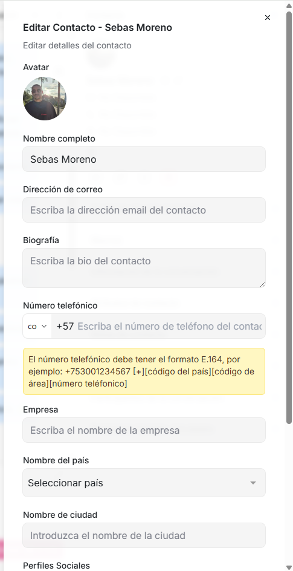

A través del tercer ícono:
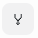
podrás **combinar contactos**, es decir, que podrás unir dos perfiles que correspondan a un mismo usuario, evitando de esta forma tener contactos duplicados.

¿En qué escenarios podría darse esta situación?: por ejemplo, si un usuario escribió por WhatsApp y también por email.

Esta opción combinará tanto las conversaciones, como los datos del contacto:

- Nombre
- Email
- Teléfono
- Etiquetas
- Atributos personalizados
- Conversaciones de todos los canales
- Historial, notas internas y archivos

De esta forma, no se perderá nada de la comunicación que hayas tenido con este usuario.

**¿Cómo usarla?**

Al dar click en el ícono, se desplegará la siguiente ventana:

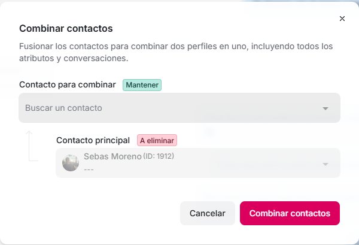

En el campo **Contacto para combinar**, en la lista desplegable sólo aparecerán los contactos que por datos comunes, Flow detecta que están duplicados, del usuario con el que estás conversando. En caso de que este usuario no tenga otro perfil, no se desplegarán opciones en la lista.

En el campo **Contacto principal,** estará el perfil de la conversación que tienes activa (desde el que estás accionando este ícono).

Al dar click en el botón “Combinar contactos”, estarías completando la acción, y en adelante solo quedará un perfil para el usuario.

**Datos importantes a tener en cuenta:**

- Es muy importante que tengas en cuenta que si usas esta opción, la acción **ya no podrá ser revertida.**
- Esta opción solo estará disponible para perfiles a quien se autorice ejercer esta acción.

Si accionas el último ícono:

eliminarás de forma permanente al usuario.

**Submenús:**

Debajo de estos 4 íconos, se presentarán varias opciones de menú desplegable:

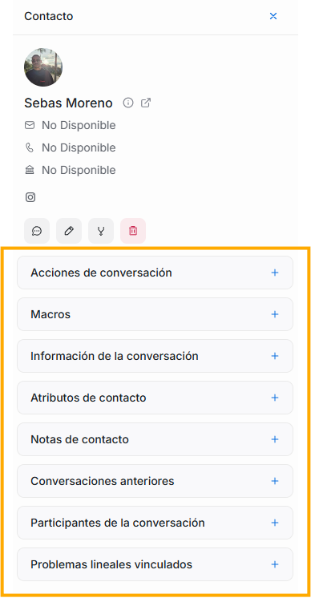

Al final del nombre de cada submenú hay un ícono de **+**, si das click sobre este, se desplegarán todas las opciones vinculadas a ese submenú.

Cada uno de estos submenús te permitirá administrar y categorizar la conversación que tienes abierta. A continuación, te los describiremos uno a uno.
