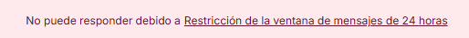

Si al intentar interactuar con una conversación, notas que tienes bloqueado el campo en el que puedes escribir y solo esta habilitado el de creación de notas internas, notarás en la parte superior de la conversación con la que te sucede esto, estará el siguiente mensaje:

Esto se debe a que Meta tiene una política de contacto estricta que busca disminuir la generación de spam para sus usuario, ¿En qué consiste?, para que puedas hablar con un usuario, solo lo podrás hacer si éste te escribe primero, a partir de esa primera interacción creada por este, tendrás un lapso de 24 horas para poder responderle, si te pasa de ese tiempo luego del último mensaje que te envíe un usuario, ya no podrás interactuar con él

En este caso, si como empresa me quiero comunicar con una persona, ¿Qué puedo hacer?:

Puedes hacer uso de **plantillas HSM**, las cuales son **mensajes preaprobados** por Meta para **iniciar conversaciones** o **retomar contactos después de 24 horas** sin actividad del usuario. Éstas las encontrarás en la sección de contactos

- Seleccionas el contacto al que deseas enviarle la plantilla
- Das click en el botón “Enviar mensaje”
- Luego click en “Mostrar bandejas de entrada”
- Seleccionas la opción que allí se despliega
- Verás que sale la opción “Seleccionar plantilla”

Una vez le envías esta plantilla al usuario, debes esperar a que éste te conteste para que puedas conversar con él.
