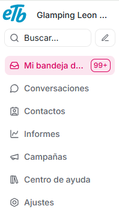
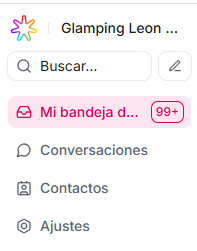
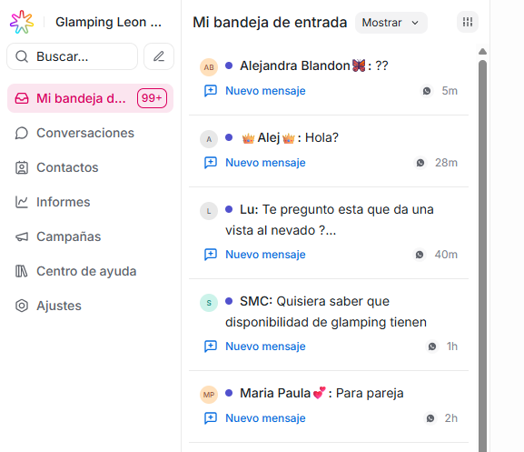

**Vista de rol administrador:**

**Vista de rol agente:**  

Es la primera opción que verás en el panel lateral izquierdo. Aquí estarán todos los mensajes que recibes; cada vez que un usuario inicia una conversación con tu empresa, aparecerá directamente en esta sección.

La gestión de cada uno de estos mensajes la podrás realizar en la sección de Conversaciones, que te explicaremos a detalle en este manual.
