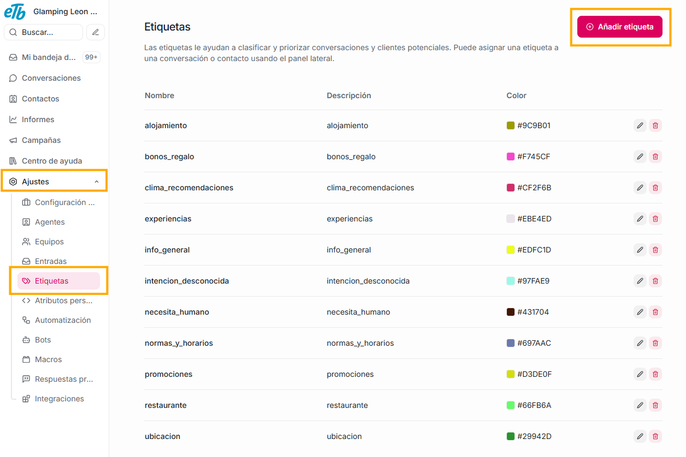
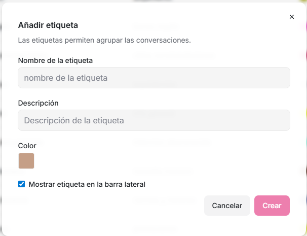
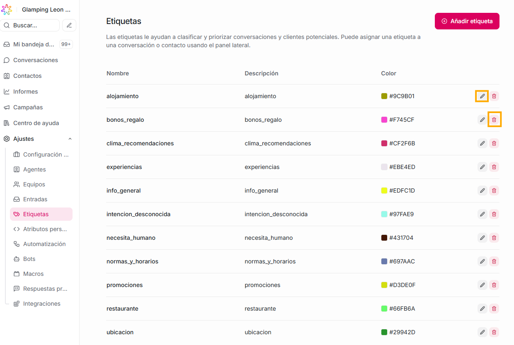

Son “tags” para categorizar conversaciones o contactos.

Qué puedes hacer aquí:

- Crear etiquetas personalizadas (ej.: _VIP_, _Soporte Técnico_, _Cobros_).

- Asignarlas manualmente o automáticamente con automatizaciones.

Te serán muy útiles para análisis, clasificación o automatización de procesos.

### **¿Cómo crear una etiqueta?**

Para crear una solo debes dar click en el botón “Añadir etiqueta”

Luego, diligencias el formulario que se abre, con los datos de:

- El nombre que le quieres asignar
- Una descripción
- El color que quieras que la identifique: aunque aparece un color al abrir el formulario, puedes cambiarlo dando click sobre el mismo, así podrás escogerlo sobre una gama de colores, o escribiendo el código del color que deseas.
- Finalmente, das click en el boton "Crear".

Si quires editar o eliminar alguna de las etiquetas que ya tienes en tu plataforma, solo debes dar click en el ícono de lápiz para **editarla**, o en el ícono de basura si lo que quieres es **eliminarla.**

