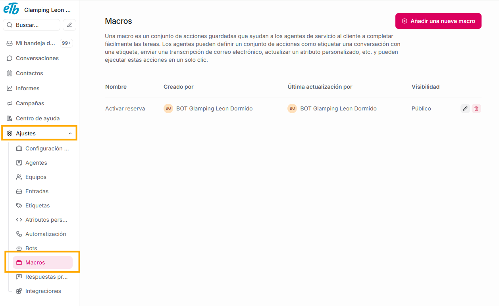
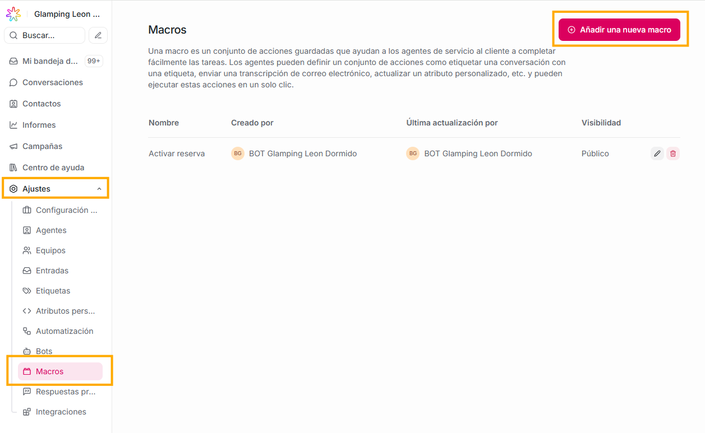
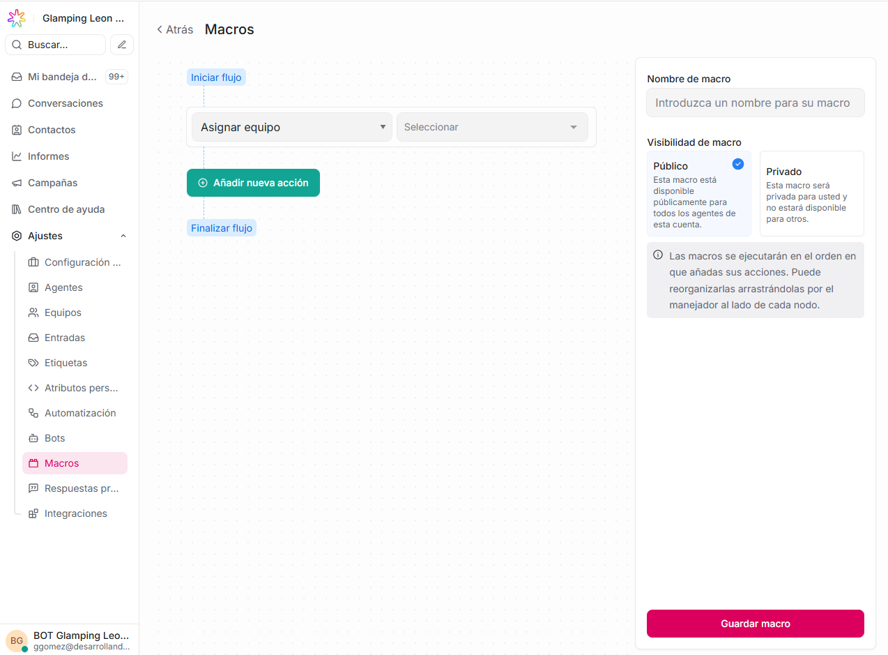
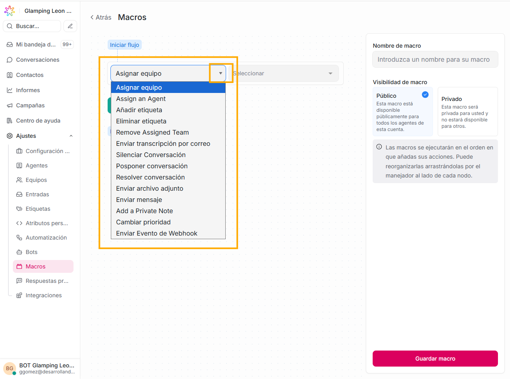
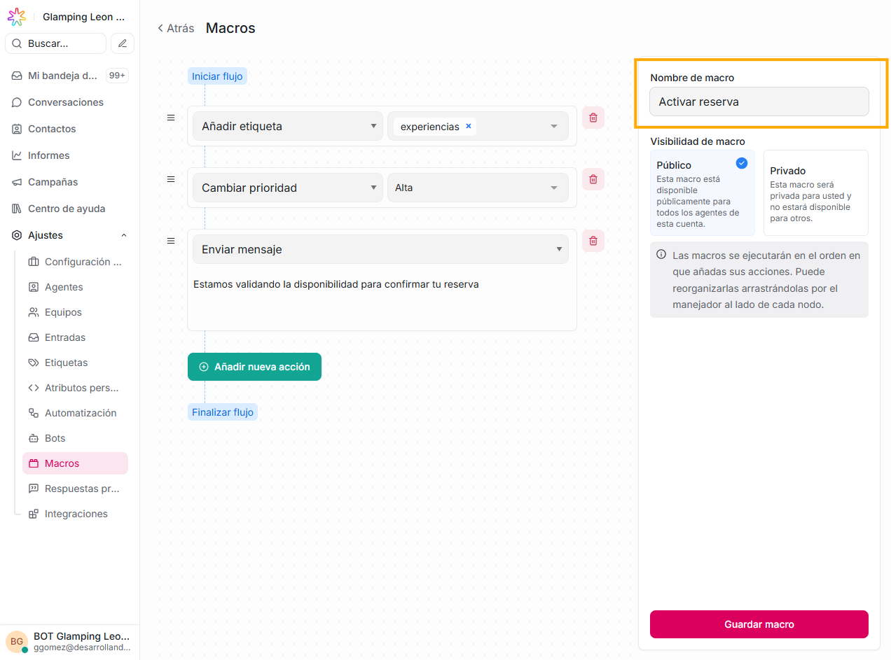
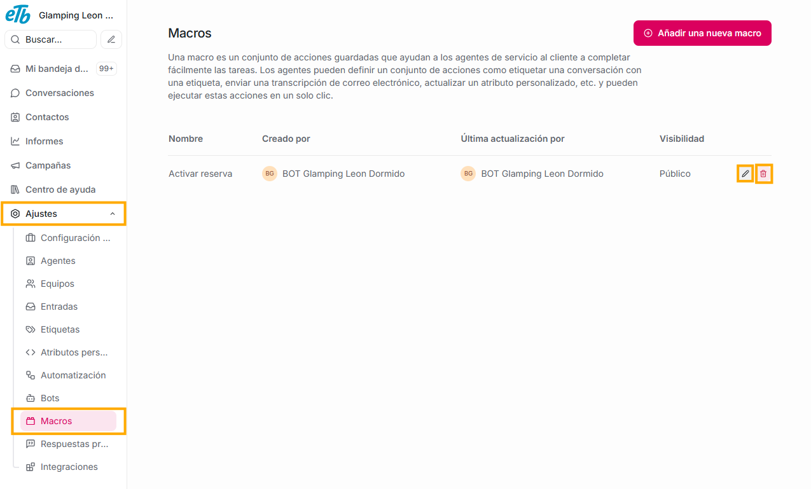
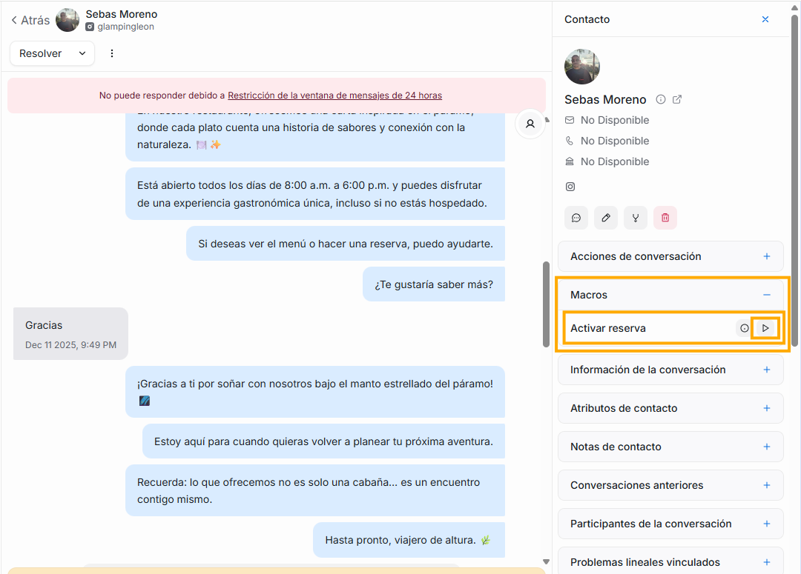
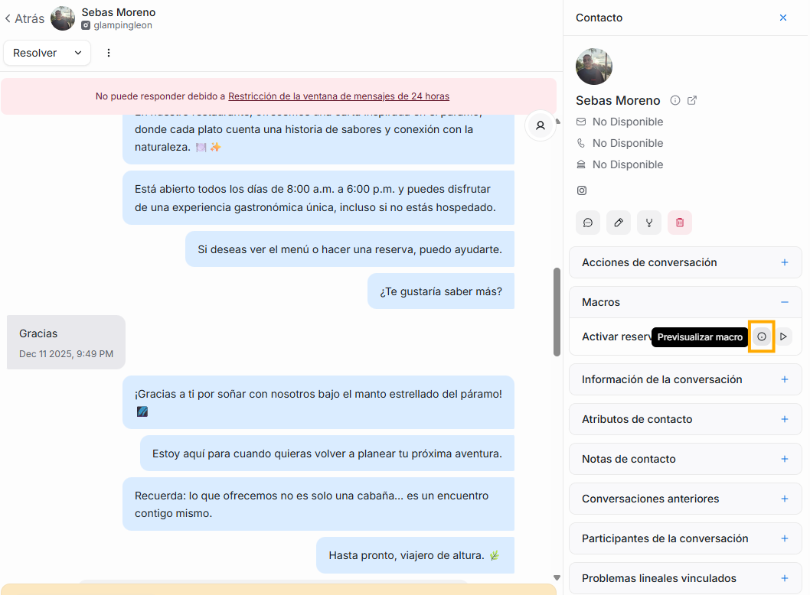
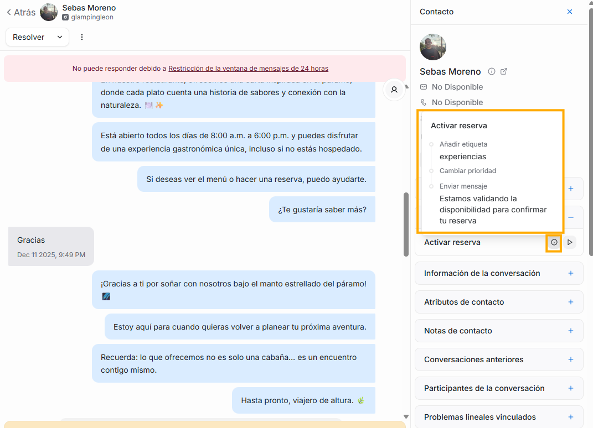

Con las macros, permites que con solo un click de un agente, se ejecuten toda una serie de acciones, ahorrándole al agente la ejecución de tareas dentro de una conversación.

### **¿Cómo crear o editar una macro?**

Debes dar click en el botón "Añadir una nueva macro"

Verás esta pantalla:

Si das click en el ícono de flecha hacia abajo que hay al final de cada campo, verás varias opciones de acciones que puedes ejecutar, al seleccionar una, en el campo siguiente podrás elegir una opción asociada a la acción que elegiste previamente.
Puedes crear una o varias acciones, de acuerdo a lo que desees que haga la macro.

Es muy importante el nombre que le pongas a tu macro, ya que así tus agentes las podrán identificar. Es decir, para que una macro entre en acción, el agente debe seleccionar el nombre de la macro, cuyas acciones quiere que se ejecuten.

Siempre que quieras puedes **editar** o **eliminar** una macro, si quieres editarla, solo debes dar click en el ícono de lápiz que esta al final de la macro que quieres modificar. Si lo que quieres es borrarla, solo es necesario dar click en el ícono de basura.

### **¿Cómo y en dónde usarlas?**

En el panel cuarto del módulo de conversaciones, hay un submenú llamado **Macros**, allí aparecerá una lista con todas las macros que hayas creado, si el agente da click en alguna de ellas, automáticamente las acciones de esa macro se ejecutarán al instante.

Si el agente quiere saber qué hace cada macro, solo debe pasar el mouse sobre el ícono de i que esta junto al nombre de cada macro

En el ejemplo de la imagen, si un agente en una conversación, en el panel cuarto en el submenú macros, da click sobre la macro llamada "Activar reserva", automáticamente y sin hacer nada más que ese click, con la conversación pasará lo siguiente:

- Se le añadirá la etiqueta "experiencias".
- Se le asignará prioridad "alta"
- Se enviará el mensaje "Estamos validando la disponibilidad para confirmar tu reserva"
