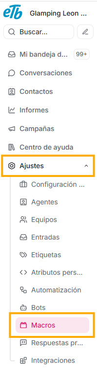
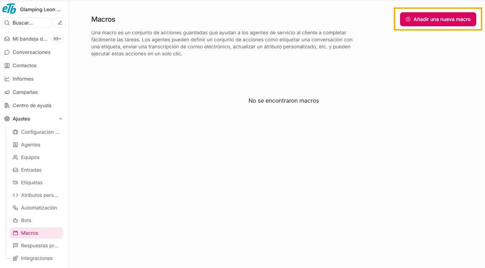

En seguida, verás la opción de Macro, esta herramienta te permite automatizar tareas y estandarizar la comunicación, ya que consiste en una serie de acciones predefinidas y un conjunto de respuestas de texto, que se guardan y pueden ejecutarse con un solo clic o comando.

El objetivo principal de las macros es reducir el tiempo de respuesta del agente y garantizar la uniformidad en el servicio al cliente.

Así entonces, las macros te permiten:

- Automatizar tareas repetitivas.
- Estandarizar la comunicación con el cliente.
- Reducir el tiempo de respuesta del agente.
- Garantizar la uniformidad en el servicio al cliente.

Qué funciones comunes puedes ejecutar con una macro:

**Respuestas Rápidas:** con una macro puedes insertar plantillas de texto predefinidas para responder a preguntas frecuentes, o para mensajes de saludo y cierre de conversación.

**Acciones de Flujo de Trabajo:** puedes ejecutar acciones simultáneas de forma automática, como:

- Cambiar el estado de la conversación (por ejemplo, a "Resuelta").
- Asignar la conversación a un equipo o agente específico.
- Agregar una etiqueta predefinida a la conversación (por ejemplo, "Facturación" o "Reclamo").
- Solicitar información específica al cliente.

**¿Cómo puedes usarlas?**

1. **Acceder a la Configuración de Macros:**
   - En el menú lateral izquierdo, verás la última opción **Ajustes**
   - Busca el submenú **Macros**.

2. **Crear una Nueva Macro:**
   - Da click en el botón “Añadir una nueva macro”

**¿Cómo puedes usar la macro en una conversación?**

Una vez que la macro está configurada, el agente la puede usar, aplicándola desde este cuarto panel, seleccionándola de la lista que te aparezca en el submenú de macros, esto hará que el texto predefinido se inserte en el campo de respuesta. De igual manera, ten en cuenta que el agente puede editar el texto si es necesario para personalizarlo. Al enviar el mensaje, la plataforma ejecutará automáticamente las acciones de flujo de trabajo que se definieron (por ejemplo, se asignará el tag "Facturación" y el estado cambiará a "Resuelta").
