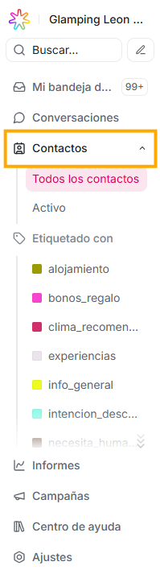
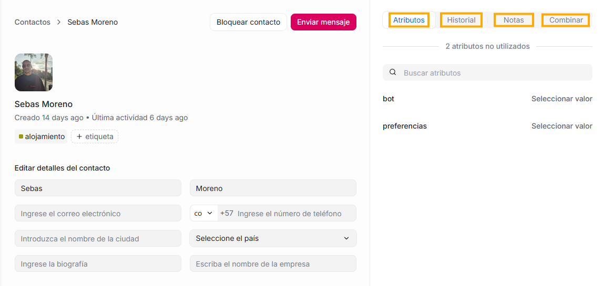

La sección **Contactos** es el **repositorio central de todas las personas** que han interactuado (o pueden interactuar) con tu empresa a través de Agentes Virtuales ETB.

## **¿Qué acciones puedes hacer desde Contactos?**

Desde este módulo puedes:

- Crear contactos manualmente

- Editar datos del cliente

- Agregar atributos y notas

- Ver historial completo

- Usar contactos para automatizaciones y campañas

- Eliminar un contacto

## **¿Qué información tiene un contacto?**

Al abrir un contacto, normalmente verás estas secciones:

### **1\. Información del contacto**

Datos básicos del cliente, por ejemplo:

- Nombre

- Email

- Teléfono

- Canal de origen (WhatsApp, web, etc.)

Esta información puede:

- Llegar automáticamente desde el canal

- Ser editada manualmente por agentes

### **2️. Atributos**

Son **campos personalizados** que tú defines.

Ejemplos:

- Tipo de cliente: _nuevo / recurrente / VIP_

- Plan contratado

- Ciudad

- Idioma

- Bot: on / off

Estos atributos:

- Se guardan en el perfil del contacto

- Se pueden usar para **automatizaciones, filtros y bots**

### **3\. Historial**

Aquí verás una lista **de las conversaciones** que ese contacto ha tenido con tu plataforma. Al dar click sobre una de las opciones de la lista, ésta te redireccionará a la conversación

Si aparece “No hay conversaciones previas”, puede ser porque:

- Es un contacto creado manualmente

- Nunca ha escrito

- Se borraron conversaciones anteriores

### **4\. Notas**

Son **notas internas** solo visibles para agentes.

Sirven para:

- Dejar contexto importante

- Registrar acuerdos

- Advertencias o recordatorios

### **5\. Combinar**

Con esta opción puedes unir dos perfiles que correspondan a un mismo usuario, evitando de esta forma tener contactos duplicados.

¿En qué escenarios podría darse esta situación?: por ejemplo, si un usuario escribió por WhatsApp y también por email.

Esta opción combinará tanto las conversaciones, como los datos del contacto:

- Nombre
- Email
- Teléfono
- Etiquetas
- Atributos personalizados
- Conversaciones de todos los canales
- Historial, notas internas y archivos

De esta forma, no se perderá nada de la comunicación que hayas tenido con este usuario.

Te explicamos esta función más a detalle en el cuarto panel del módulo de Conversaciones
