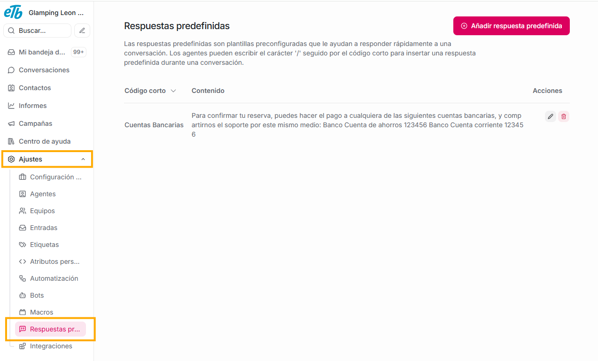
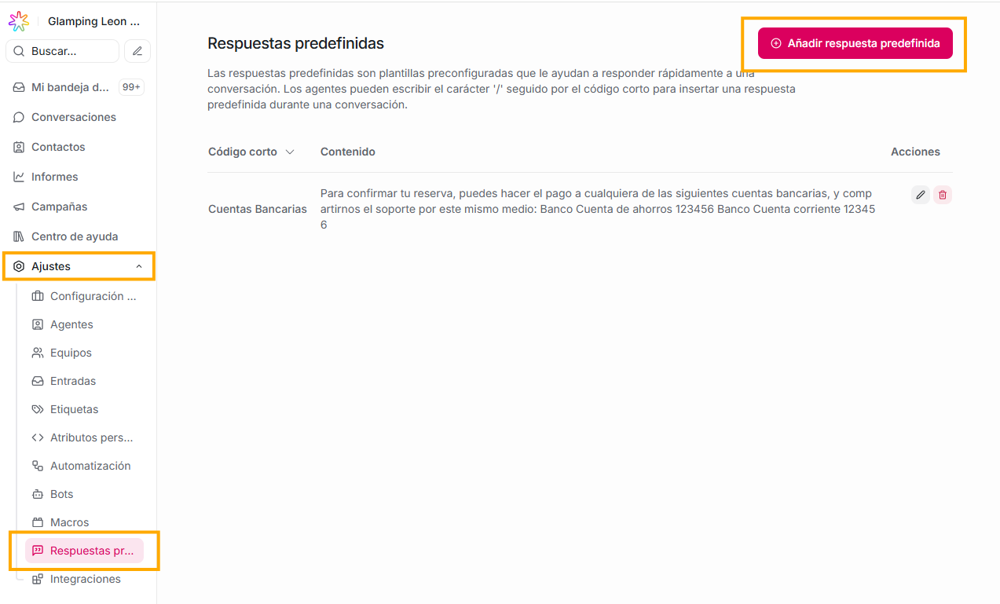
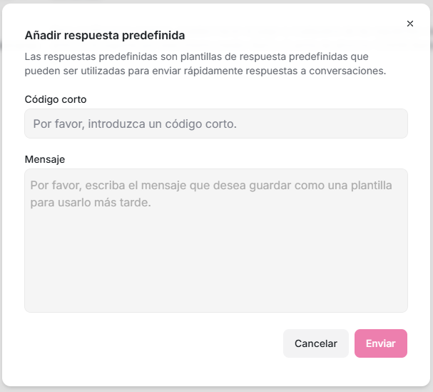
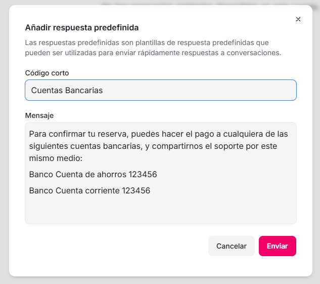

Las **respuestas predefinidas** son plantillas de mensajes rápidos, podríamos decir que son **mensajes guardados** que los agentes pueden reutilizar rápidamente durante una conversación con un cliente.

Sirven para:

- Responder más rápido

- Mantener mensajes consistentes

- Reducir errores y escritura repetitiva

- Mejorar la experiencia del cliente y del agente

Son **manuales** (el agente decide cuándo usarlas), a diferencia de bots o automatizaciones.

### **¿Cómo crear una respuesta predefinida?**

Haz clic en el botón de **Añadir respuesta predefinida**

Completa los campos:

1. **Código corto:** es el nombre interno que le quieres asignar. La palabra que asignes como código será la que usen los agentes cuando quieran emplear esta respuesta.

Por ejemplo:

- saludo

- horario

Cuando lo quieras usar en una conversación, solo debes escribir el signo **/** y se desplegará una lista con todos los códigos cortos de todas las respuestas predefinidas que existen en tu plataforma. Ten en cuenta que **siempre puedes modificar el texto antes de enviarlo**, no es obligatorio usarlo tal cual.

Ejemplo:

- **Código corto**: saludo

- En conversación escribes: /saludo

2. Mensaje

Es el texto que se enviará al cliente.

Ejemplo:
Para continuar con el proceso de reserva, puedes hacer el pago a culquiera de las siguientes cuentas bancarias:

3. Para guardar esta respuesta predefinida, solo debes dar click en el botón **Enviar**
