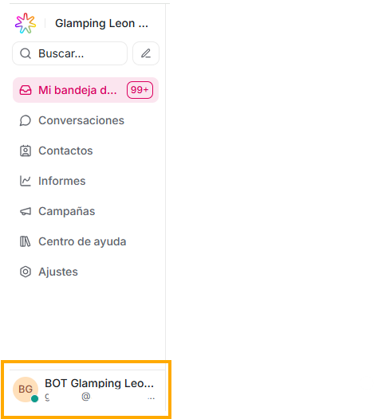
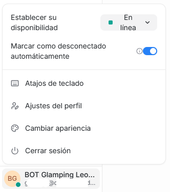

En la parte inferior, donde ves tu nombre de perfil, encontrarás las siguientes opciones:

1. ## Establecer su disponibilidad:

   Te permite seleccionar con que estado quieres que te vean conectado:

- En línea
- Ocupado
- Desconectado

2. ## Ajustes del perfil

Es el lugar donde **cada agente** puede configurar su información personal, preferencias, seguridad y notificaciones dentro de la plataforma.

En la primera sección puedes ver y configurar:

- Tu avatar o foto de perfil
- Tu nombre completo
- El nombre que se verá en tus conversaciones
- Tu dirección de correo

Si quieres editar o modificar alguno de estos datos, solo debes dar click en el botón “Actualizar perfil”

#### **Interface:**

En Font size te brindamos 5 diferentes tamaños de visualización de plataforma, para que la puedas ajustar de acuerdo a tus preferencias, solo debes dar click en la que elijas

Smaller: muy pequeño

Small: pequeño

Predeterminado: estandar

Large: grande

Larger: muy grande

#### Firma de mensaje personal:

Si la configuras y tu guardas, esta será la firma que puedes adjuntar cada vez que respondas un mensaje de la bandeja de entrada.

#### Tecla rápida para enviar mensajes

Te damos dos opciones, de acuerdo a la que selecciones, cada vez que la uses enviará automáticamente el mensaje que hayas escrito en el campo de conversaciones.

#### Contraseña:

Si deseas modificar tu contraseña, puedes hacerlo aquí ingresando tu contraseña actual y diligenciando dos veces tu nuevo clave de acceso a Flow.

#### Alertas de audio:

Puedes asignar un tono para que te notifique cada vez que recibes un mensaje nuevo, aquí también puedes elegir en qué ocasiones deseas que suene.

#### Token de acceso:

Es aquí donde obtienes el token que podrás usar cuando estes haciendo una integración con una API. Puedes copiarlo o resetearlo.

3. ## Atajos de teclado:

   Una guía rápida con los atajos que puedes usar con tu teclado para movilizarte en tu aplicación de Flow o ejecutar acciones dentro de ella.

4. ## Cambiar apariencia:

   Si te gusta clara o eres del team oscuro, es aquí en donde puedes determinar como verás tu aplicación

5. ## Cerrar sesión

Si concluiste tu trabajo y deseas cerrar sesión, puedes hacerlo con los siguientes pasos:

1. En el dashboard principal, debes dirigirte al menú lateral izquierdo, al final de esta, verás tu usuario y tu email

2. Al dar click en tu nombre de usuario, se desplegará una serie de opciones

3. La última opción de esta lista es “Cerrar sesión”, solo debes dar click allí y automáticamente tu sesión se cerrará, redireccionándote a la pantalla de login
