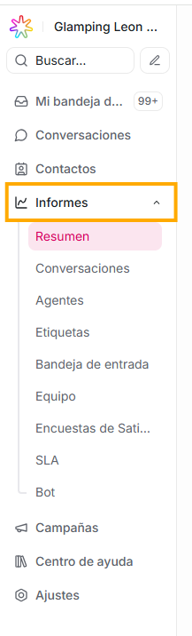
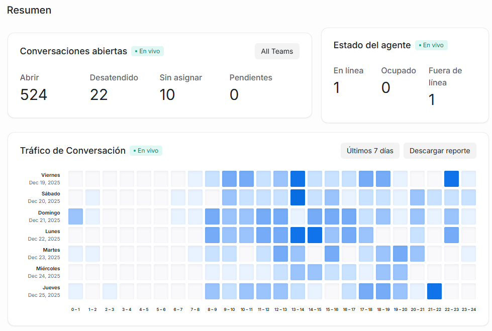
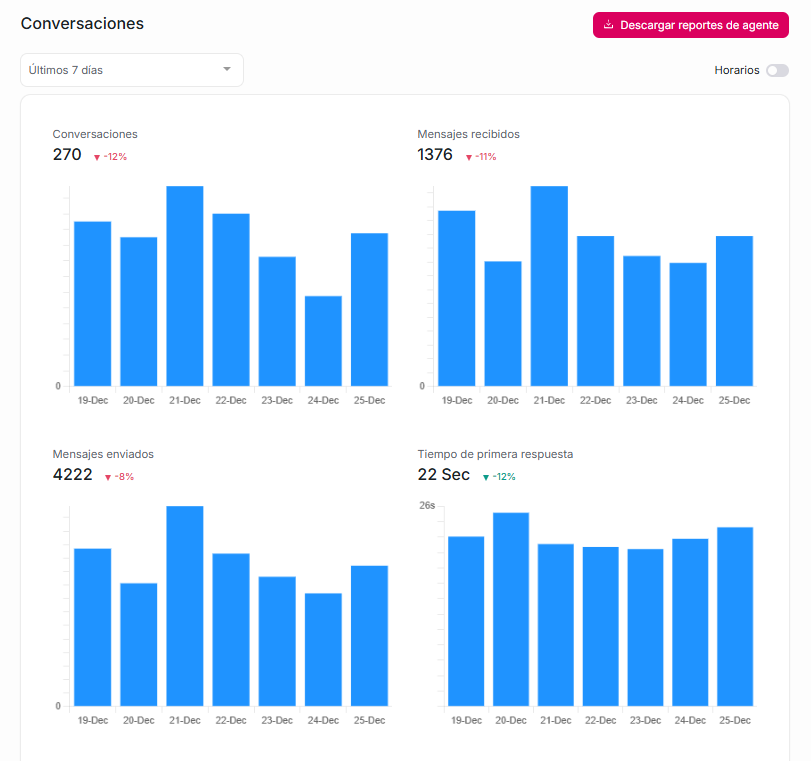

Esta sección es muy importante ya que te permite **entender qué está pasando realmente en tu operación de atención**, tomar decisiones basadas en datos y mejorar tanto la experiencia del cliente como el desempeño del equipo.

Esta sección puede ser la base para mejorar el soporte, tomar decisiones objetivas y demostrar resultados con datos.

Sin informes:

- Reaccionas tarde

- No sabes qué mejorar

Con informes:

- Actúas a tiempo

- Optimizás procesos

- Mejoras la experiencia del cliente

### ¿Para qué sirve esta sección?

Para **medir, analizar y mejorar**:

- La **carga de trabajo** del equipo

- Los **tiempos de respuesta y resolución**

- El **desempeño de agentes y equipos**

- La **satisfacción del cliente**

- El **cumplimiento de SLA**

Sin informes, trabajas “a ciegas”. Con informes, **puedes justificar decisiones y optimizar procesos**.

### ¿Por qué es clave para un equipo de soporte?

**1️. Visibilidad del rendimiento del equipo**

Puedes responder preguntas como:

- ¿Cuántas conversaciones entran por día?

- ¿Cuántas se resuelven?

- ¿Estamos sobrecargados?

**2️. Medición de tiempos (calidad del servicio)**

Los informes muestran:

- Tiempo promedio de resolución

- Conversaciones sin atender

**3️. Evaluación individual de agentes**

Desde informes puedes ver:

- Conversaciones atendidas por agente

- Tiempo de respuesta de cada uno

- Resoluciones exitosas

Esto te permite tomar acciones frente a:

- Feedback

- Capacitación

- Reconocimiento del buen desempeño

**4\. Control por equipos e inbox**

Si trabajas con:

- Varios equipos

- Varias bandejas (WhatsApp, web, email, etc.)

Los informes te ayudan a ver:

- Qué canal recibe más mensajes

- Qué equipo está más cargado

Por lo que es ideal para **redistribuir trabajo**.

**5️. Seguimiento de etiquetas y categorías**

Los reportes por **etiquetas** permiten saber:

- Qué problemas son más frecuentes

- Qué temas generan más conversaciones

**6️. Medición de satisfacción del cliente (SAT)**

Si usas encuestas:

- Puedes ver qué tan satisfechos están los clientes

- Detectar agentes o procesos con baja calificación

**7️. Cumplimiento de SLA**

Los informes SLA te ayudan a saber:

- Si estás cumpliendo los tiempos prometidos

- Cuántos casos se incumplen

### 1\. Resumen

Es un panel general que resume los datos más importantes en un solo lugar.

Qué muestra:

- Total de conversaciones en un periodo

- Total de conversaciones desatendidas / sin asignar / pendientes

- Te muestra en qué horarios por día se están dando las conversaciones de los últimos 7 o 30 días.

- Las conversaciones abiertas y desatendidas por cada agente.

Es ideal para tener una visión rápida del soporte, sin entrar en reportes más detallados.

### 2\. Conversaciones

Enfocado en el movimiento y calidad de las conversaciones.

Puedes ver este reporte seleccionando el periodo de tiempo que quieras analizar:

De acuerdo al periodo de tiempo seleccionado, te mostrará:

- Número de conversaciones creadas

- Cantidad de mensajes recibidos

- Cantidad de mensajes enviados

- El tiempo promedio que se están tardando tus agentes en dar la primera respuesta

- Tiempo total en el que se resuelven las conversaciones

- El tiempo promedio que tardan tus clientes en recibir respuestas a sus mensajes.

### 3\. Agentes

Mide el desempeño de cada agente del equipo.

Qué muestra:

- Número de conversaciones atendidas por cada agente

- Tiempo de respuesta por agente

- Tiempo de resolución por agente

- Tiempos activos / inactivos

- Cantidad de conversaciones resueltas

Esta sección te permitirá

- Identificar quién está sobresaturado.

- Ver quién responde más rápido.

- Evaluar desempeño para retroalimentación.

### 4\. Etiquetas

Mide el uso e impacto de las etiquetas, mostrándote la cantidad de conversaciones asociadas a cada etiqueta

Es muy útil ya que te permite:

- Saber qué tipo de problema aparece más.

- Detectar temas urgentes (fallas, reclamos, bugs).

- Medir campañas (etiquetas como "promo", "hot sale", etc.).

### 5\. Bandeja de entrada

Analiza cada canal o "Inbox" que tengas conectado.

Qué muestra:

- Conversaciones por canal (WhatsApp, Facebook, Live Chat, Email)

- Tiempos de respuesta por canal

Para qué sirve:

- Ver cuál canal recibe más tráfico.

- Optimizar agentes por canal.

- Saber si un canal está colapsado.

### 6\. Equipo

Solo aparece si tienes **equipos creados** en Agentes Virtuales ETB.

Qué muestra:

- Rendimiento por equipo

- Conversaciones asignadas a cada equipo

- Tiempos de respuesta por equipo

- Eficiencia y carga de trabajo

Usos:

- Evaluar qué equipo necesita más agentes.

- Ver quién tiene mejor velocidad de respuesta.

### 7\. Encuestas de satisfacción

Es el reporte de las encuestas mostradas al cliente al cerrar conversaciones.

Qué incluye:

- Porcentaje de satisfacción general

- Cantidad de respuestas positivas y negativas

- Comentarios de los clientes (si están activos)

- Puntuación de satisfacción del cliente por agente o por canal

Para qué sirve:

- Ver si el cliente está contento con la atención.

- Identificar agentes con calificaciones más bajas.

- Detectar problemas específicos en el servicio.

### 8\. SLA (Índice de satisfacción del cliente)

Este reporte aparece solo si configuraste **políticas de SLA**.

Qué muestra:

- Conversaciones que cumplieron el SLA

- Conversaciones que fallaron el SLA

### 9\. Bot

Disponible si usas bots (automations o agentes virtuales).

Qué muestra:

- Número de conversaciones manejadas por bots

- Interacciones completadas

- Conversaciones transferidas del bot a un agente
