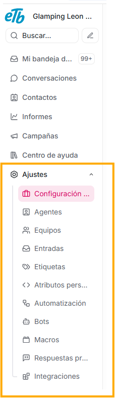
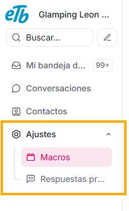

La plataforma Agentes virtuales ETB maneja dos tipos de roles:

- Administrador
- Agente

**Vista de rol administrador:**

**Vista de rol agente:**  

El rol administrador cuenta con más opciones ya que puede crear, editar o eliminar funciones que afectan a la plataforma transversalmente.
El rol agente tiene opciones que se limitan a brindar las herramientas para poder gestionar las conversaciones.

Por la misma razón, aunque ambos roles cuentan con el módulo Ajustes, el administrador tiene más submenús que el agente:

**Componentes del módulo ajustes para el rol administrador:**

**Componentes del módulo ajustes para el rol agente:**

Estas opciones del módulo Ajustes son explicadas a detalle en la sección de Ajustes de este manual.
