El segundo panel te mostrará una lista de conversaciones, de acuerdo a tres factores:

1. El filtro que hayas realizado en el primer panel
2. El filtro que elijas en la parte superior de este segundo panel. Aquí tienes 3 opciones:
   - **Mías:** Flow permite asignar conversaciones para que sean atendidas exclusivamente por un agente. Así entonces, si eres un agente, al iniciar sesión, si seleccionas este encabezado, verás la lista de las conversaciones que han sido asignadas para ser atendidas por ti.
   - **Sin asignar:** aquí aparecen todas las conversaciones que han sido creadas, pero que aún no cuentan con un agente asignado.
   - **Todos:** en este filtro estarán todas las conversaciones, es decir, tanto las que han sido asignadas a un agente (incluyéndote a ti y a tus compañeros con rol agente), como las que aún no cuentan con un asesor encargado.

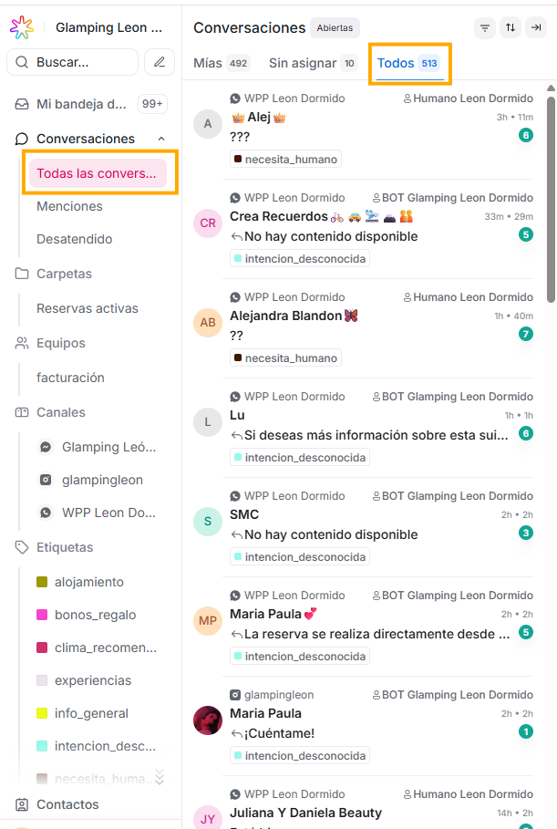

3. En la parte superior de este segundo panel, verás la palabra “Conversaciones”, y al final de esta línea, 3 íconos. A continuación te describiremos uno a uno estos íconos:

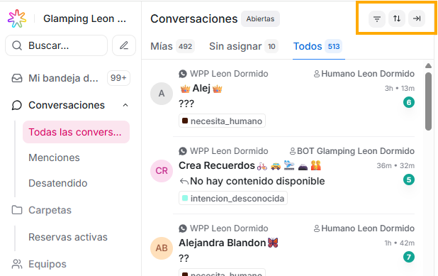

### 1. **Primer ícono: filtrar conversaciones**

El primero de ellos es la opción para Filtrar conversaciones, es la opción que te da Flow para crear tus propios filtros, de acuerdo a las necesidades de tu negocio. Te explicaremos paso a paso como aprovechar esta funcionalidad:

Si das click sobre este ícono, verás tres campos:

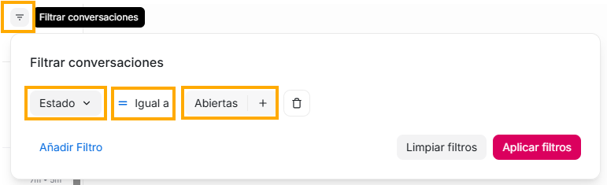

En el **primer campo**:

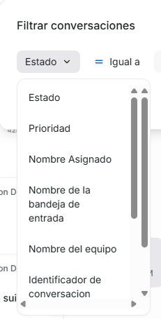

si das click sobre la flecha hacia abajo, se desplegará una lista con varias opciones generales asignadas por el sistema, que corresponden a funcionalidades que existen en Flow y que abarcan muchas de las descripciones principales que pueden tener tus conversaciones como:

- Estado
- Prioridad
- Nombre asignado
- Nombre de la bandeja de entrada
- Nombre del equipo
- Identificador de conversación
- Nombre de Campaña
- Etiquetas
- Idioma del navegador
- Nombre del País
- Enlace de referencia
- Creado el
- Última actividad

Luego de estos items mencionados, continuará la lista con todos los **atributos de conversación personalizados** que hayas creado en tu plataforma (Si quieres aprender cómo crearlos y administrarlos, puedes visitar la sección del manual "Ajustes", en la opción "Atributos personalizados". Recuerda que en este filtro que estamos viendo solo aparecerán los atributos de conversación, no de contacto)

El **segundo campo** te mostrará las siguientes opciones:

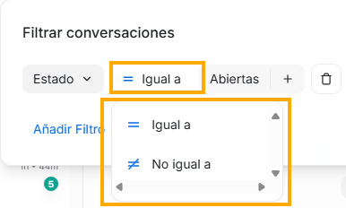

Y las opciones que veas en el **tercer campo,** dependerán del item que hayas seleccionado en el primer campo, por ejemplo, si en el primer campo seleccionas “Estado”, en este último campo verás las siguientes opciones:

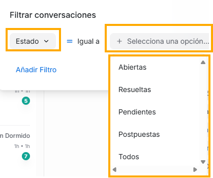

pero si en el primer campo seleccionas la opción Prioridad, en el último campo la lista será la siguiente:

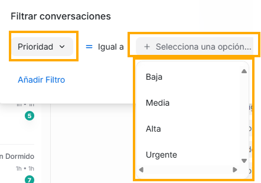

La opción que elijas en este tercer campo será identificada porque tendrá un chulito de color azul. Ten en cuenta que en este tercer campo, puedes elegir más de una opción a la vez, si así lo deseas.

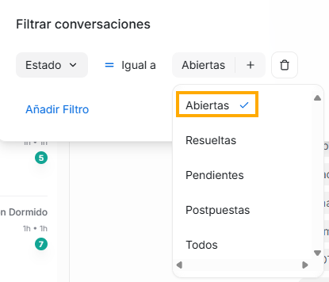

Para que las conversaciones se filtren de acuerdo a esta selección que realizaste, debes dar click en el botón “Aplicar filtros”. Si por el contrario no quieres que se filtren las conversación en tu bandeja de acuerdo a estos filtros, puedes seleccionar el botón “Limpiar filtros”

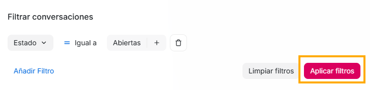

Una vez lo hagas, en el segundo panel aparecerá la lista de las conversaciones que cumplan con este filtro, y verás en la parte superior nuevos íconos:

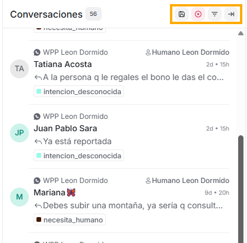

Si deseas guardar permanentemente este filtro que hiciste, solo debes dar click en el primer ícono - que es la imagen de un disquet -, y te saldrá una ventana en donde podrás ingresar el nombre que quieras darle al filtro que creaste - este será el nombre que aparecerá en la lista del **submenú "Carpetas"** del **primer panel** -, y dar click en el botón **"Guardar filtro".**

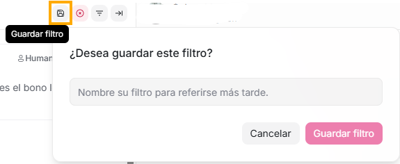

Si quieres quitar este filtro, es decir, si por ejemplo solo querías filtrar las conversaciones temporalmente pero no lo quieres dejar permanentemente, entonces solo debes dar click en el segundo icono, el de la X, al hacerlo, eliminarás el filtro que creaste.

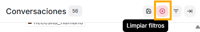

Si quisieras aplicar nuevos filtros a este filtro que ya tienes, puedes hacerlos dando click en el tercer ícono de esta nueva vista, y solo debes repetir el procedimiento de acuerdo a lo que ya vimos, de esta manera, aplicarás filtros anidados.

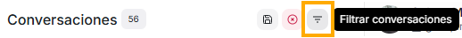

El último ícono te permite ampliar de forma horizontal la vista del segundo panel

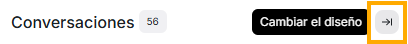

### 2. **Segundo ícono: Ordenar conversaciones - FILTRO PRINCIPAL**

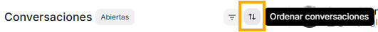

Al dar click sobre este ícono te mostrará dos opciones:

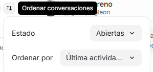

La primera siempre te mostrará las opciones de estado que pueden tener tus conversaciones, solo debes dar click en la flecha hacia abajo que esta al final del campo. La que elijas de la lista, será la palabra que verás junto al título Conversaciones que encabeza este segundo panel, esto debido a que este será el filtro principal de todas tus conversaciones, **este es el filtro principal a partir del cual se ejecutarán todos los demás filtros.**

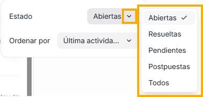

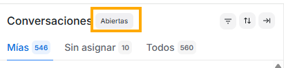

La segunda opción te permite elegir el criterio con base al cual se establezca el orden de la lista de conversaciones, por ejemplo, que las primeras de la lista sean las conversaciones más recientes.
Flow te ofrece varias opciones para que puedas elegir de acuerdo a lo que más te beneficie.

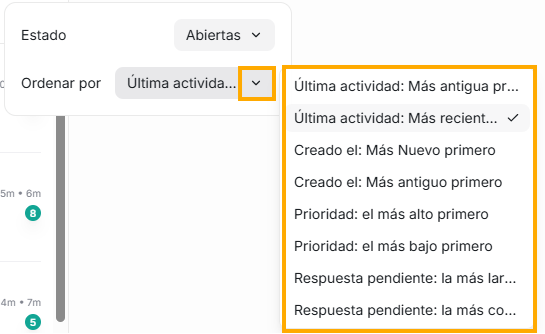

### 3. **Tercer ícono: cambiar diseño**

El último ícono te permite ampliar horizontalmente la vista del segundo panel.

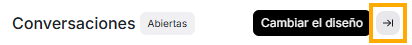
