El Centro de Ayuda es una herramienta de soporte interno para agentes que funciona como una base de conocimiento donde tu equipo puede:

- Consultar procedimientos

- Revisar guías de atención

- Buscar respuestas rápidas

- Leer tutoriales

- Consultar preguntas frecuentes

## **¿Qué uso le puedes dar?**

### **1. Unificar respuestas**

Evita que cada agente responda diferente. Todos consultan el mismo contenido:

- Políticas

- Procesos

- Casos frecuentes

### **2. Reducir tiempos de atención**

El agente no tiene que preguntar al supervisor ni buscar en chats antiguos. Solo entra al Centro de Ayuda y busca: “fallo de pago”, “reclamos”, etc.

### **3. Capacitación de nuevos agentes**

Aquí los nuevos integrantes pueden:

- Aprender procesos

- Revisar flujos

- Conocer respuestas estándar

Sin depender de acompañamiento constante.

### **4️. Mantener el conocimiento organizado**

La información queda:

- Estructurada por categorías

- En artículos claros

- Actualizada en un solo lugar

## **¿Quién puede verlo?**

Es una sección para uso interno: **solo agentes y administradores**, no es visible públicamente, funciona como una wiki interna del equipo.

## **Crear un portal**

Para poder usar este módulo, el primer paso que debes dar es crear un portal. Te explicamos el paso a paso:

1. Ingresa al módulo **Centro de ayuda**.
2. Selecciona la opción **Ajustes**.
3. Da click en el botón **Crear portal**

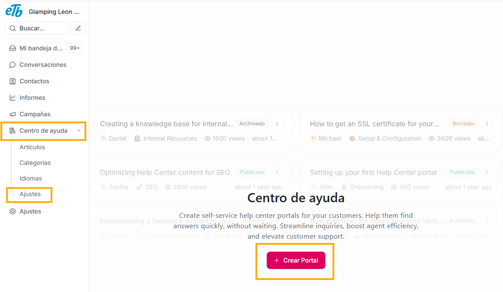

Verás el siguiente formulario:

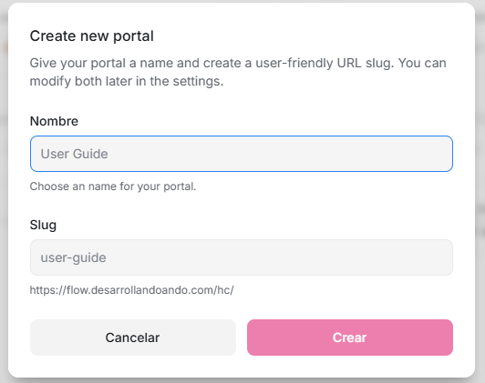

Aquí, en el campo **nombre**, puedes dilgenciar el título que quieres que tenga tu portal, automáticamente, el campo **slug** se llenará con la misma palabra o frase que pongas en el campo nombre.
Verás en la parte inferior del formulario, el link con el que quedará tu portal, de acuerdo al nombre que estas indicando en el formulario.

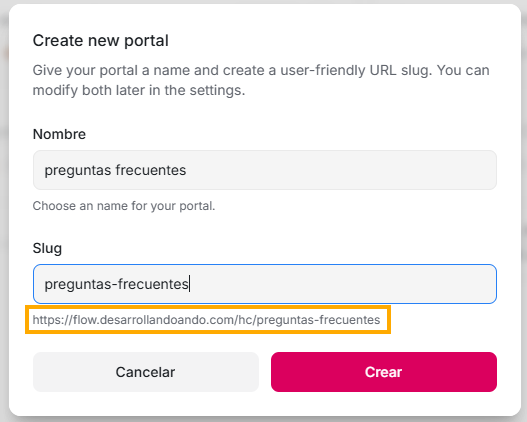

Al dar click en el botón **"Crear"**, habrás registrado tu portal de Centro de ayuda.

## **Categorías**

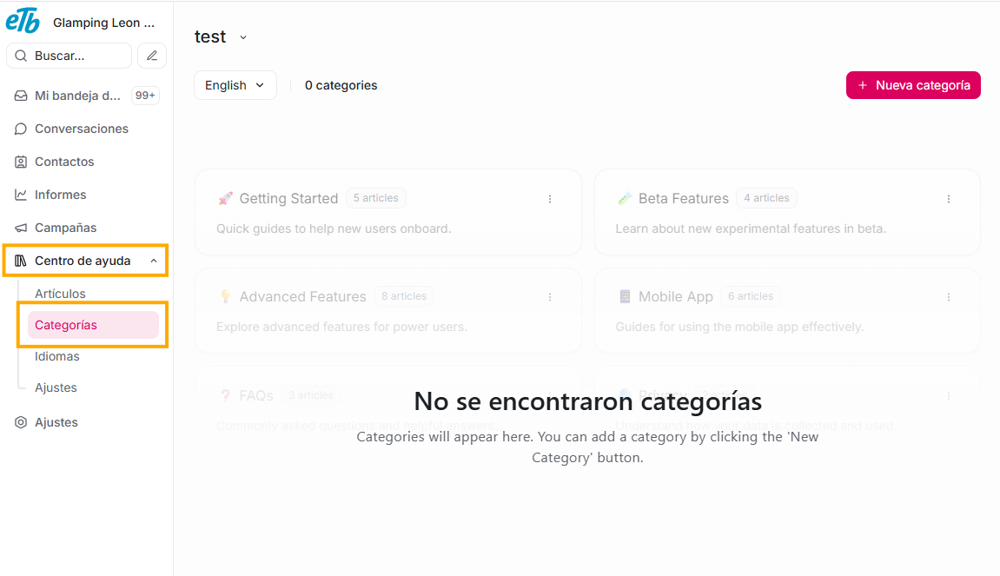

Puedes agrupar tus artículos por categorías.

Para crearlas solo debes:

- Ingresar a:

  - Centro de ayuda
  - Categorías

- Dar click en el botón "Nueva categoría"

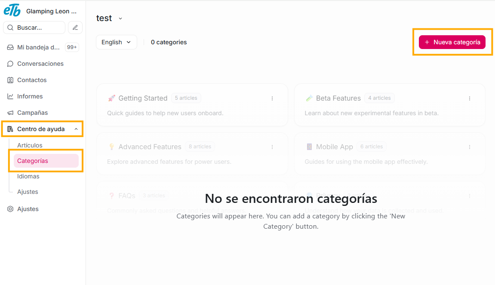

Verás el siguiente formulario:

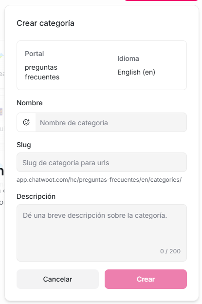

Si diligencias el campo **nombre**, verás que que se diligencia el campo slug con el mismo título que pones en el campo **nombre**. La descripción es útil para indicar qué contenido quieres que tenga esta categoría.

Por último, al dar click en el botón **"Crear"**, automáticamente verás tu nueva categoría. Puedes crear todas las que estimes necesarias, de acuerdo a como te sirva organizar tus artículos.

## **Crear un artículo**

Para crear un artículo, solo debes ingresar a este módulo en:

- Centro de ayuda
- Artículos

Y dar click en el botón "New article"

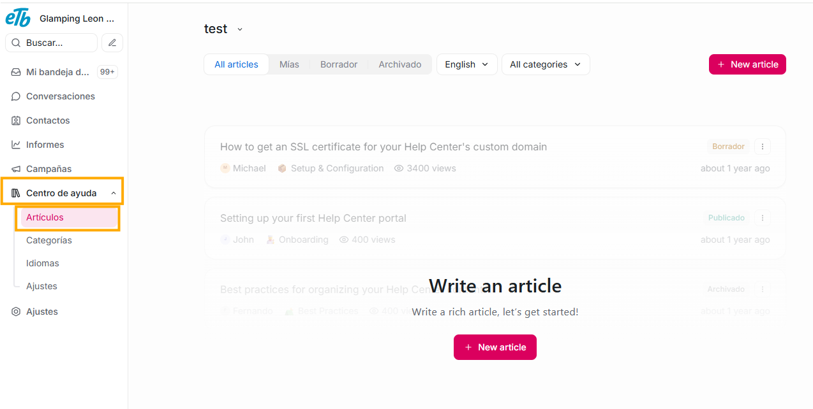

Aquí ya solo debes escribir el título y el contenido de tu artículo

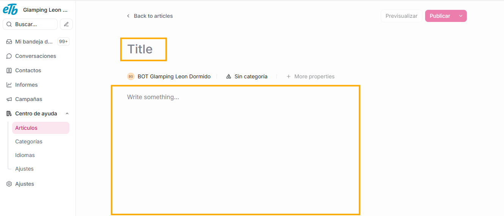

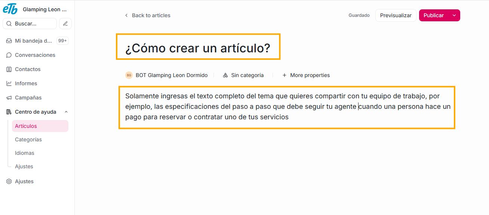

Una vez has creado el contenido de tu artículo, puedes asignarlo a una categoría dando click en la segunda opción que aparece debajo del título, de allí se desplegará una lista con todas las categorías que has creado, y solo debes dar click en la que escojas para tu artículo:

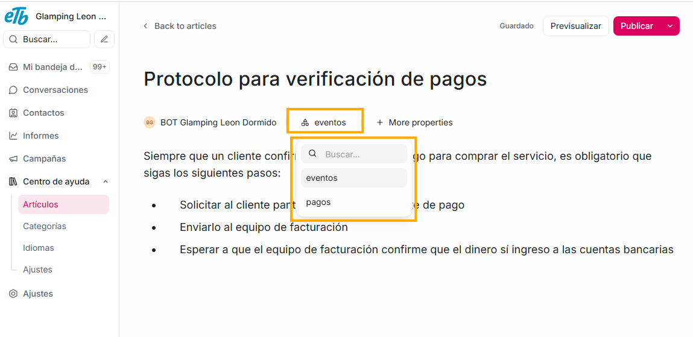

Para que el artículo pueda ser compartido y consultado por otros agentes, debes dar click en el botón **publicar**. Luego de ello puedes pasarle el link a otros agentes para que lo puedan visitar.

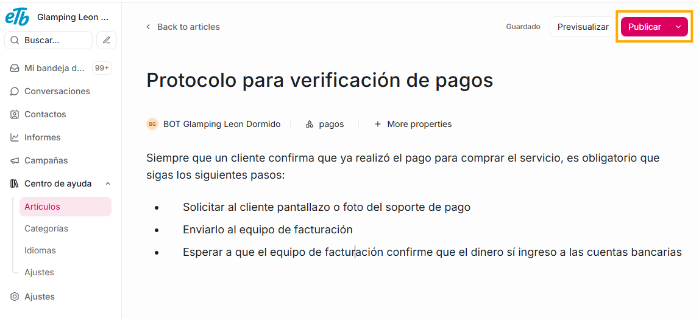
