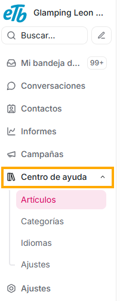

Esta sección es una función para crear un **portal de artículos** donde tus clientes pueden:

- Leer tutoriales

- Consultar preguntas frecuentes

- Resolver dudas sin escribir al soporte

Es el equivalente a una **base de conocimiento**, como una lista de preguntas frecuentes, lo cual te ayudará a:

- Reducir tickets repetidos

- Explicar procesos largos

- Ayudar a nuevos usuarios

- Enviar guías sin tener que escribirlas cada vez

- Automatizar respuestas usando enlaces a artículos
- Estandariza la información

- Da una cara profesional a tu empresa

Ten en cuenta que el portal queda **oculto** hasta que tú decidas publicarlo: No se publica automáticamente, así que no hay riesgo.
