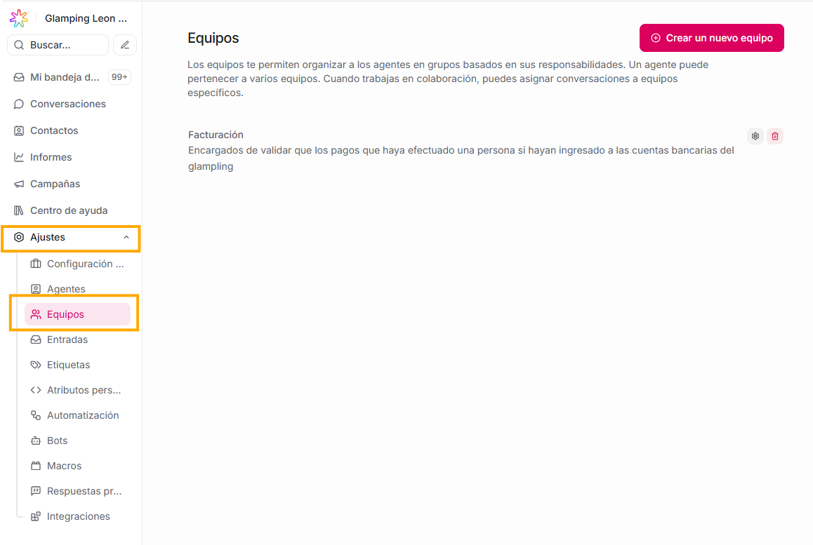
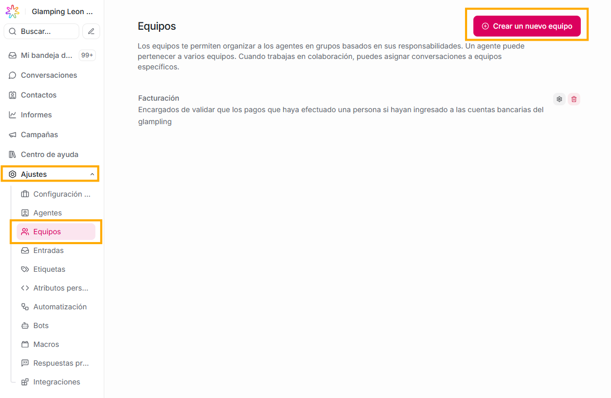
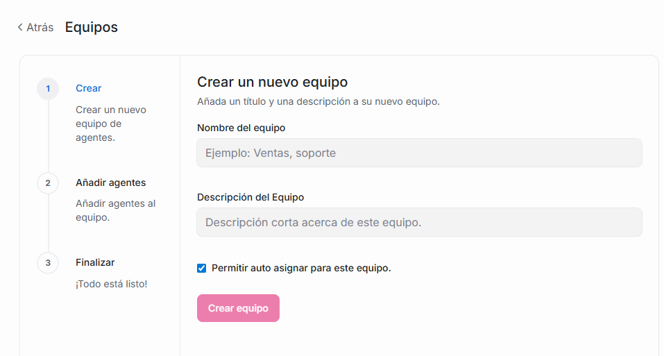
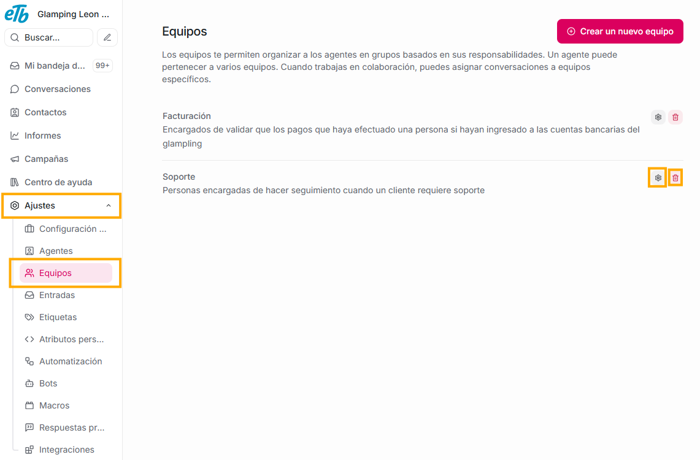
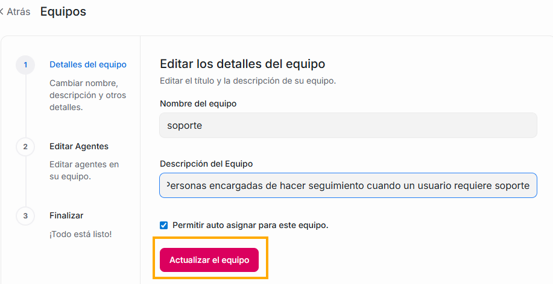

Flow te permite agrupar a tus agentes por equipos según su rol, área o tipo de trabajo.

Por ejemplo:

- Equipo de Soporte
- Equipo de Ventas
- Equipo de Cobranza

Cada equipo puede manejar ciertos inbox (bandejas), recibir asignaciones, tener miembros propios y reglas específicas.

Es decir: Aquí pudes organiza a tus agentes para distribuir las conversaciones de forma ordenada.

Con los equipos puedes:

**1. Agrupar agentes:** puedes tener varios grupos de trabajo para dividir tareas, lo que te permitirá mejorar la organización interna.
**2. Repartir conversaciones automáticamente:** cuando un inbox está asignado a un equipo, los agentes miembros de ese equipo recibirán la conversación.
**3. Controlar permisos y visibilidad:** un equipo puede tener acceso solo a ciertas bandejas.
**4. Filtrar conversaciones por equipo:** en el módulo de conversaciones, si tienes equipos creados, verás que en el primer panel existe un filtro con las conversaciones asignadas por equipo.
**5. Analizar el comportamiento a través de reportes:** Flow te mostrará reportes especificos por equipo (para ampliar esta información, puedes visitar la sección de **informes** de este manual)

### **Crear un nuevo equipo:**

1. Debes dar click en el botón “Crear un nuevo equipo”

Te pedirá:

2. Nombre del equipo

Ejemplos:

- Soporte técnico
- Ventas
- WhatsApp Team
- Customer Success

3. Descripción

Para explicar el propósito del equipo.

4. Elegir miembros del equipo

Verás una lista con todos tus agentes, aquí podrás seleccionar los que quieras que pertenezcan a ese equipo.

5. Dar click en el botón "Finalizar"

### **Editar o eliminar un equipo:**

Si quieres modificar información de un equipo que ya existe, solo debes dirigirte a la sección de - Ajustes - Equipos, dar click en el ícono de configuración que esta al final del nombre del equipo que quieres editar, allí se te mostraá el mismo formulario con el que creaste tu equipo, haces las modificaciones que deseas, y finalmente debes dar click en el botón "Actualizar el equipo"

Si lo que deseas es eliminarlo, ubicado en la sección de - Ajustes - Equipos, das click en el ícono de basura que esta al final del nombre del equipo que quieres borrar.
