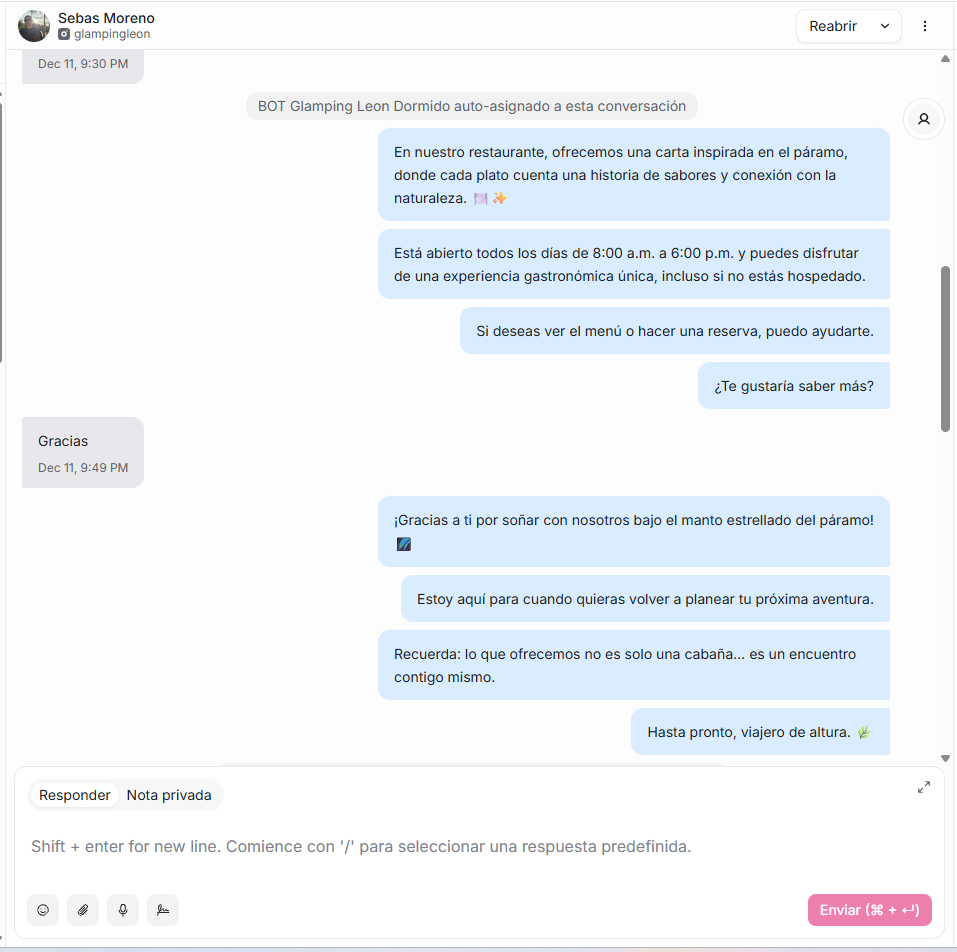
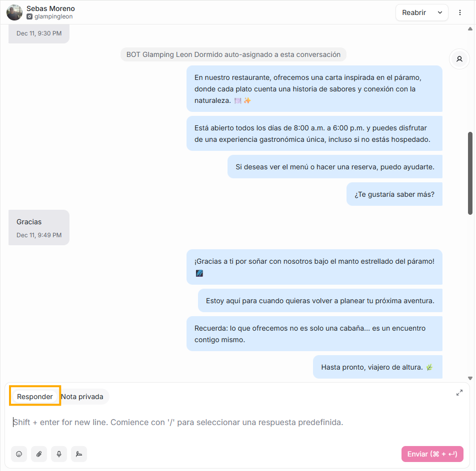
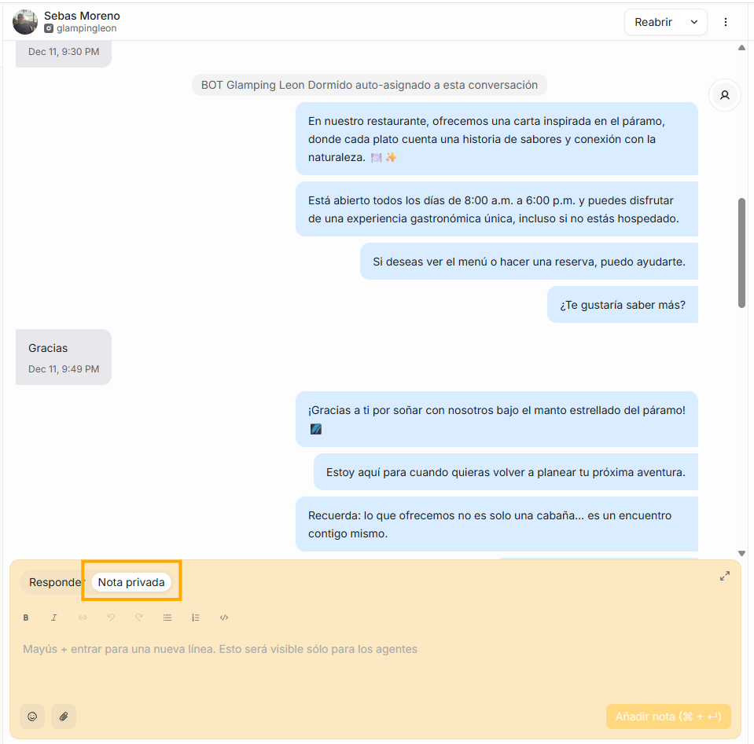

En este panel visualizarás la conversación que hayas seleccionado de la lista del segundo panel.

Aquí el agente podrá interactuar con la conversación, escribiendo la respuesta, adjuntando archivos y usando emojis.

En el campo en donde el agente diligencia la respuesta, hay dos encabezados:

1. **Responder:** en la parte inferior de esta opción verás 5 íconos

   - emoji: puede usarlos para interactuar con la persona con la que está conversando.
   - Clic: para adjuntar documentos si así lo requiere
   - Micrófono: para que envíe mensajes de voz
   - Firma: puedes adjuntar firma si así es requerido, si no la has configurado, el sistema te redireccionará a ajustes de perfil para que allí puedas hacerlo.
   - ícono de whatsapp: te mostrará las plantilla de whatsapp que ya tienes configuradas, puedes seleccionar la que se ajuste a la conversación para que no tengas que redactar todo un mensaje.

2. **Nota privada:** sabrás que estas aquí porque el campo se pondrá en color amarillo. Es un mensaje interno que puedes agregar dentro de una conversación, es **visible solo para los agentes** y **oculto totalmente para el cliente**. Puedes usarlo para compartir contexto entre agentes, documentar decisiones internas, registrar información importante, coordinar con otros equipos, tener trazabilidad interna o detalles que quieres dejar registrados sin que el cliente los vea. Piensa en ella como un apunte interno dentro del chat. Para guardarla solo debes dar click en Añadir nota, de esta forma la nota aparecerá dentro del hilo de la conversación, pero **solo para agentes**.

